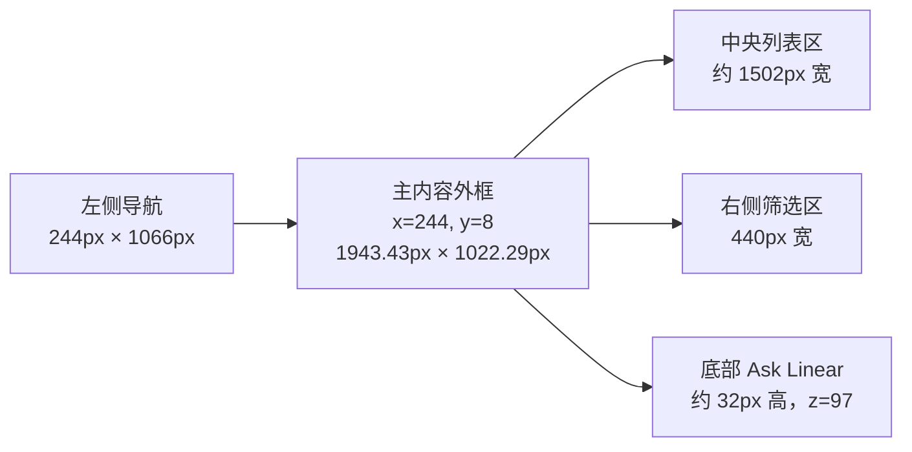

# Linear 前端视觉系统拆解与交易复盘软件设计参照

> 分析对象：`https://linear.app/yunkoo/team/YUN/active`  
> 页面标题：`Yunkoo › Active issues`  
> 采集日期：2026-07-10  
> 采集状态：深色主题、桌面端、右侧筛选详情面板展开  
> 实测视口：`2195 × 1066 CSS px`；设备像素比：`1.75`  
> 可见 DOM 元素：608 个；页面无纵向滚动，`scrollHeight = viewportHeight = 1066px`

---

## 0. 阅读说明与数据可信度

本文不是依据宣传截图进行的风格归纳，而是从当前已登录页面的实际渲染结果中采集：页面结构、可访问性树、元素边界框、计算后样式和根级 CSS 自定义属性。

为避免把推断误当成 Linear 的官方规范，文中使用三种标记：

| 标记 | 含义 | 可信度 |
|---|---|---|
| **[E] Exact** | 页面 CSS 变量或浏览器计算样式的直接值 | 最高 |
| **[M] Measured** | 通过元素边界框测得的位置、宽高和层级 | 高 |
| **[I] Inferred** | 从截图、重复节奏或结构关系中推导的设计规则 | 参考 |

### 0.1 本次分析的边界

- 覆盖当前页面中可见的 App Shell、左侧导航、顶部标题与视图切换、问题分组、问题行、右侧筛选面板、底部 Ask Linear 工具栏和左下角更新卡片。
- 覆盖静态、选中、禁用感、层级、命中区、色彩、字型、间距、边框、圆角、阴影和动效变量。
- 未主动展开菜单、模态框、问题详情、命令面板、表单编辑器，因此不把这些隐藏界面的样式写成“当前可见 token”。
- 页面根节点共暴露 455 个 CSS 自定义属性，其中大量为未激活模块、编辑器、设置页或哈希变量。本文只保留当前视图直接使用或对复刻设计系统有价值的语义变量。
- Linear 的颜色大量使用 `LCH`；本文保留原值，不强制转换为 Hex，避免色域和舍入误差。

---

## 1. 设计结论：为什么 Linear 看起来“安静但高级”

Linear 的质感不是来自大字号、渐变或重阴影，而来自五个同时成立的系统约束：

1. **低明度表面分层**：背景差异通常只有 2–5 个 LCH 明度单位，靠细微亮度而不是色相变化分区。
2. **固定密度节奏**：导航项和小控件以 `28px` 为核心高度，列表行以 `44px` 为核心高度，整个界面几乎没有随机高度。
3. **文字权重克制**：主体信息主要使用 `12px / 13px` 与 `450 / 500`，很少依赖粗体制造层级。
4. **形状语义稳定**：容器使用 `8–12px` 圆角；选项、标签、筛选器使用 `9999px` 胶囊；图标按钮固定为圆形命中区。
5. **边框和阴影只承担结构职责**：绝大多数元素无阴影；主内容框与浮层才使用极轻的双层阴影和亚像素边框。

对交易复盘软件最值得借鉴的不是“全黑”，而是：**高密度信息通过一致的行高、弱分割线、灰阶文字和渐进展开保持可扫描性**。

---

## 2. 页面整体结构与坐标系

### 2.1 顶层布局



### 2.2 主要区域实测

| 区域 | X | Y | 宽 | 高 | 视觉与结构 |
|---|---:|---:|---:|---:|---|
| 浏览器可视区域 | 0 | 0 | 2195 | 1066 | [M] 当前页面坐标基准 |
| 左侧导航 `nav` | 0 | 0 | 244 | 1066.29 | [M] 固定宽度；根变量 `--sidebar-width: 244px` |
| 主内容 `main` | 244 | 8 | 1943.43 | 1022.29 | [M] `12px` 圆角、细边框、轻双层阴影、裁切内部内容 |
| 顶部主标题区 `header` | 244.57 | 8.57 | 1942.29 | 86.57 | [M] 内含两行：面包屑标题 + 视图胶囊 |
| 中央问题列表行 | 244.57 | 133.14 | 1502.29 | 44 | [M] 右侧面板展开后的有效列表宽度 |
| 右侧面板 `aside` | 1746.86 | 95.14 | 440 | 934.57 | [M] 绝对定位，内部纵向滚动 |
| 右侧分段控件 | 1763.43 | 105.71 | 400.57 | 32 | [M] 外壳 `5px` 圆角，内部标签 `28px` 高 |
| 底部 Ask Linear 区 | 244 | 1030.29 | 1951.43 | 32 | [M] 覆盖在主内容底边之上，层级 `z=97` |
| 左下更新卡片 | 10 左侧附近 | 约 1000 | 约 224 | 54.5 | [M] `14px` 圆角、独立阴影、层级 `z=10` |

### 2.3 顶层层级关系

```text
body
├─ nav 左侧导航
│  ├─ 工作区切换 / 搜索 / 新建
│  ├─ 一级导航：Inbox / My issues
│  ├─ Workspace 分组
│  ├─ Favorites 分组
│  │  └─ Team 树：Yunkoo → Issues / Projects / Views
│  └─ 左下更新卡片与帮助入口
├─ main 主内容框
│  ├─ header
│  │  ├─ 面包屑：Yunkoo › Issues
│  │  └─ 视图胶囊：All issues / Active / Backlog / 自定义视图
│  ├─ 主工具区：筛选 / 显示 / 关闭右栏
│  ├─ 问题列表
│  │  ├─ sticky 分组头：In Progress
│  │  ├─ issue row：YUN-1
│  │  ├─ sticky 分组头：Todo
│  │  ├─ issue row：YUN-3
│  │  └─ issue row：YUN-4
│  └─ aside 右侧筛选面板
│     ├─ tablist：Assignees / Labels / Priority / Projects
│     └─ 当前筛选项：No assignee · 3
└─ 全局覆盖层
   ├─ Ask Linear 工具栏
   ├─ 通知区域
   └─ 浮层 / 菜单 / 模态框（当前未展开）
```

### 2.4 空间占比

- 左侧导航约占视口宽度 `11.1%`。
- 主内容约占 `88.5%`，与左栏之间没有额外大间隙，只通过主内容的 `8px` 上下外边距和圆角形成“嵌入式工作台”。
- 右侧面板展开时约占主内容宽度 `22.6%`；中央列表约占 `77.3%`。
- 主内容左边缘与视口严格对齐于 `244px`，说明侧栏是固定布局基准，而不是自适应比例列。

---

## 3. 颜色系统

## 3.1 核心语义色变量

| 建议语义名 | Linear 原变量 / 实测值 | 用途 | 当前可见位置 |
|---|---|---|---|
| `canvas` | `--bg-color: lch(1.82% 0 272 / 1)` | 最底层画布 | 左侧导航底、底部 Ask Linear 背景 |
| `sidebar` | `--bg-sidebar-color: lch(1.82% 0 272 / 1)` | 侧栏底色 | 整个左导航 |
| `surface-primary` | `--color-bg-primary: lch(4.52% 0.3 272)` | 一级内容表面 | 主内容框、顶部、列表底 |
| `surface-secondary` | `--color-bg-secondary: lch(9.02% 2.1 272 / 1)` | 强一点的二级表面 | 交互/展开表面储备 |
| `surface-tertiary` | `--color-bg-tertiary: lch(11.27% 3 272 / 1)` | 选中或强调表面 | 选中控件附近层级 |
| `surface-quaternary` | `--color-bg-quaternary: lch(7.22% 0.75 272 / 1)` | 弱容器表面 | 分组条、右侧标签外壳附近 |
| `group-surface` | `lch(7.67 0.75 272)` | 分组标题/分段外壳 | In Progress、Todo、右侧 tablist |
| `pill-idle` | `lch(6.449 0.493 272)` | 未选中胶囊 | All issues、Backlog、自定义视图 |
| `pill-active` | `lch(12.234 0.879 272)` | 选中胶囊 | Active |
| `segmented-idle` | `lch(9.599 0.943 272)` | 右侧未选分段 | Labels、Priority、Projects |
| `segmented-active` | `lch(15.384 1.329 272)` | 右侧选中分段 | Assignees |
| `text-primary` | `--color-text-primary: lch(100% 0 272 / 1)` | 最高层级文本 | 当前标题、选中项、问题标题 |
| `text-secondary` | `--color-text-secondary: lch(90.35% 1.15 272 / 1)` | 次级主文本 | 面包屑、分组标题 |
| `text-tertiary` | `--color-text-tertiary: lch(61.399% 1.15 272 / 1)` | 元数据/未选中项 | 编号、日期、胶囊、说明 |
| `text-quaternary` | `--color-text-quaternary: lch(36.308% 1.15 272 / 1)` | 极弱图标/占位信息 | 未激活图标、弱提示 |
| `border-primary` | `--color-border-primary: lch(8.84% 1.38 272 / 1)` | 主框轮廓 | main 外边界 |
| `border-secondary` | `--color-border-secondary: lch(13.16% 1.38 272 / 1)` | 常规分割 | 标签、芯片、内部边界 |
| `border-tertiary` | `--color-border-tertiary: lch(15.32% 1.38 272 / 1)` | 更明确的交互边界 | 元数据胶囊 |
| `focus` | `--focus-ring-color: #5e69d1` | 键盘焦点 | `1px` 焦点描边 |

### 3.2 当前可见背景色全集

以下值均出现在当前视口的计算样式中：

| 值 | 出现次数 | 角色判断 |
|---|---:|---|
| `transparent` | 577 | 默认；大多数元素只继承父表面 |
| `lch(4.52 0.3 272)` | 7 | 主内容和主要内容区 |
| `lch(7.67 0.75 272)` | 5 | 分组标题与右侧分段外壳 |
| `lch(6.449 0.493 272)` | 4 | 未选中顶部胶囊 |
| `lch(10.691 0.493 272)` | 3 | 更亮的交互层/局部覆盖层 |
| `lch(9.599 0.943 272)` | 3 | 右栏未选中分段 |
| `lch(1.82 0 272)` | 2 | 侧栏与全局底层 |
| `lch(40 60 80)` | 1 | 工作区头像底色 |
| `lch(0 0 0 / 0.004)` | 1 | 几乎不可见的微弱覆盖层 |
| `lch(6.32 1.8 272)` | 1 | 左下更新卡片表面 |
| `lch(12.234 0.879 272)` | 1 | Active 选中态 |
| `lch(18.406 0.879 272)` | 1 | 选中态更高亮内部层 |
| `rgb(38, 181, 206)` | 1 | 青色项目/标签标识 |
| `lch(15.384 1.329 272)` | 1 | Assignees 选中态 |

### 3.3 当前可见文本与图标颜色全集

| 值 | 主要用途 |
|---|---|
| `lch(100 0 272)` | 纯主文本；不是直接 Hex 白，而是 LCH 中性色 |
| `lch(90.077 1 272)` | 工作区名称与较强次级文字 |
| `lch(90.35 1.15 272)` | 标题、面包屑、强次级文字 |
| `lch(90.668 1.375 272)` | 分组标题 |
| `lch(62.672 1.375 272)` | 右侧标签与弱元数据 |
| `lch(61.399 1.15 272)` | 常规 tertiary 文本 |
| `lch(60.307 1 272)` | 左导航默认文本 |
| `lch(36.308 1.15 272)` | 弱图标、辅助信息 |
| `lch(62.672 7 78.116)` | 偏黄绿色状态计数 |
| `lch(62.672 7 272.028)` | 偏紫灰状态计数 |
| `lch(100 5 288.421)` | 轻微偏冷的高亮图形 |
| `rgb(255,255,255)` | 少数原生/覆盖文本 |

### 3.4 当前可见图形强调色

- `rgb(38,181,206)`：青色标签/项目点。
- `lch(80 90 85)`：黄色状态圆环或强调线。
- `lch(48 59.31 288.43)`：蓝紫色进度环。
- `lch(66 80 48)` 与 `lch(58 73 29)`：紧急优先级橙红色图标。
- `rgb(122,134,85)`：工作区/团队的橄榄绿识别色。
- 这些颜色只用于小面积图标、点和环；大面积背景仍保持中性低彩度。

### 3.5 配色原则

1. **表面只改明度，不轻易改色相**：主界面基本固定在 `h≈272` 的冷中性色轴上。
2. **彩色只承担语义**：优先级、标签、项目和状态才出现彩色。
3. **选中态优先使用表面亮度 + 文本明度**，而不是品牌色填充。
4. **边框比背景略亮但仍极暗**，形成“可感知、不可抢眼”的结构线。
5. **同一层级最多保留一个高亮焦点**；当前页顶部是 Active，右侧是 Assignees。

---

## 4. 字体系统

### 4.1 字体家族

```css
--font-regular: "Inter Variable", "SF Pro Display", -apple-system,
  BlinkMacSystemFont, "Segoe UI", Roboto, Oxygen, Ubuntu, Cantarell,
  "Open Sans", "Helvetica Neue", "Linear Thai", sans-serif;

--font-display: var(--font-regular);

--font-monospace: "Berkeley Mono", "SFMono Regular", Consolas,
  "Liberation Mono", Menlo, Courier, monospace;

--font-emoji: "Apple Color Emoji", "Segoe UI Emoji", "Segoe UI Symbol",
  "Segoe UI", "Twemoji Mozilla", "Noto Color Emoji", "Android Emoji";
```

- 当前 608 个可见元素中，607 个使用 Inter 系统栈。
- 根节点出现一次 `Noto Sans SC`，但实际 UI 子树由 Inter 系统栈覆盖。
- 中文在当前环境中会回退到系统可用的 CJK 字体；交易软件应显式增加 `Noto Sans SC` 或 `PingFang SC`，避免中英文基线差异。

### 4.2 字号 token

| Linear 变量 | 值 | px | 当前页面用途 |
|---|---:|---:|---|
| `--font-size-micro` | `round(up, .6875rem, 2px)` | 约 11px | 头像缩写等极小信息 |
| `--font-size-mini` | `.75rem` | 12px | 胶囊、元数据、分段标签、日期 |
| `--font-size-small` | `.8125rem` | 13px | 导航项、问题标题、编号、分组标题 |
| `--font-size-regular` | `.9375rem` | 15px | 编辑器/内容区储备，当前列表不常用 |
| `--font-size-large` | `1.125rem` | 18px | 较大内容储备，当前视图未显著出现 |
| `--font-size-title3` | `1.25rem` | 20px | 标题储备 |
| `--font-size-title2` | `1.5rem` | 24px | 二级大标题储备 |
| `--font-size-title1` | `2.25rem` | 36px | 一级大标题储备 |

### 4.3 当前页面实际字号分布

| 计算字号 | 可见元素数 | 典型内容 |
|---:|---:|---|
| 16px | 388 | 多数布局容器继承值；不代表所有可见文本都以 16px 绘制 |
| 13px | 88 | Inbox、My issues、问题标题、编号、分组标题 |
| 12px | 107 | 视图胶囊、日期、标签、分区标签、Ask Linear |
| 13.3333px | 22 | 浏览器/默认控件继承及计数 |
| 11px | 2 | `YU` 头像缩写 |
| 14px | 1 | 顶部工作区名称 |

### 4.4 字重 token

| Linear 变量 | 值 | 使用建议 |
|---|---:|---|
| `--font-weight-light` | 300 | 不建议用于深色小字 |
| `--font-weight-normal` | 450 | 正文、编号、元数据；Linear 的关键质感之一 |
| `--font-weight-medium` | 500 | 导航、胶囊、标签、问题标题 |
| `--font-weight-semibold` | 600 | 高强调标题，当前视图很少使用 |
| `--font-weight-bold` | 700 | 极少使用，避免使界面变厚重 |

当前可见元素统计：`400` 约 412 个、`500` 约 171 个、`450` 约 24 个、`550` 仅工作区名称 1 个。

### 4.5 典型文本样式配方

| 样式名 | 字号 | 字重 | 行高 | 字距 | 颜色 | 位置 |
|---|---:|---:|---:|---:|---|---|
| Workspace title | 14px | 550 | 23px | -0.1px | `lch(90.077 1 272)` | 左上工作区名 |
| Nav item | 13px | 500 | normal | normal | `lch(60.307 1 272)` | 左侧导航 |
| Section label | 12px | 500 | normal | normal | `lch(60.307 1 272)` | Workspace / Favorites |
| Breadcrumb | 13px | 500 | normal | normal | `lch(90.35 1.15 272)` | Yunkoo › Issues |
| View pill | 12px | 500 | normal | normal | idle tertiary / active primary | 顶部视图切换 |
| Group heading | 13px | 500 | normal | normal | `lch(90.668 1.375 272)` | In Progress / Todo |
| Issue identifier | 13px | 450 | normal | -0.26px | `lch(61.399 1.15 272)` | YUN-1 |
| Issue title | 13px | 500 | normal | normal | `lch(100 0 272)` | test / Connect your tools |
| Metadata | 12px | 450 | normal | normal | `lch(61.399 1.15 272)` | 日期、标签、项目 |
| Right panel tab | 12px | 500 | normal | normal | active primary / idle muted | Assignees 等 |

### 4.6 编辑内容相关根变量

虽然当前列表页未展开编辑器，但页面已加载并暴露：

```css
--editor-font-size: .9375rem;          /* 15px */
--editor-font-weight: 450;
--editor-line-height: 1.6;
--editor-letter-spacing: -.00666667em;
--editor-text-color: #e2e3e5;
--editor-block-spacing-small: .375rem; /* 6px */
--editor-block-spacing: 1rem;          /* 16px */
--editor-block-spacing-large: 1.375rem;/* 22px */
--editor-block-radius: 6px;
```

交易复盘中的“复盘正文/心得编辑器”可以直接采用这组配方，与高密度列表区形成舒适度差异。

---

## 5. 间距与尺寸系统

### 5.1 最小单元

Linear 并非严格的单一 4px 网格，而是两层体系：

- **结构网格：4px**。主要间距落在 `4 / 8 / 12 / 16 / 24 / 28 / 32 / 44px`。
- **光学修正：1–2px**。边框、内缩、图标对齐和相邻按钮分隔使用 `1 / 2 / 3 / 5 / 6 / 10px`。

因此，交易复盘软件可把 `4px` 作为基础单位，把 `1px` 和 `2px` 仅用于边框与光学校正，避免把 `2px` 当成所有布局的基础网格。

### 5.2 当前可见 gap

| gap | 典型位置 |
|---:|---|
| 2px | 右侧分段控件、底部工具按钮 |
| 3px | 元数据芯片内部 |
| 4px | 面包屑、顶部标题内部、视图组局部 |
| 6px | 头像+名称、按钮图标+文字、更新卡片 |
| 8px | 分组标题、问题行内容、常规图文组合 |
| 12px | 顶部两行区或较大的横向组 |

### 5.3 常用内边距

| 内边距 | 用途 |
|---|---|
| `0 2px` | 纯图标按钮中的光学修正 |
| `0 3px` | 面包屑小链接 |
| `0 4px` | 折叠分组、轻量容器 |
| `0 8px` | 状态条、元数据芯片 |
| `0 10px` | 顶部视图胶囊 |
| `4px 12px` | 右侧分段标签 |
| `10px 12px` | 左下更新卡片 |
| `12px` | 右侧面板主体内边距 |
| `16px` | 设置/表单类区域的标准水平留白 |

### 5.4 核心高度

| 高度 | 组件 | 说明 |
|---:|---|---|
| 14px | 常规小图标 | 当前可见频率最高的图标尺寸 |
| 16px | 中号图标 | 导航与问题属性 |
| 18px | 标题/工具栏图标 | 少量较重要操作 |
| 20px | 工作区头像 | `YU` 圆形头像 |
| 24px | 次级图标按钮、面包屑 | 极紧凑操作 |
| 28px | 一级导航项、视图胶囊、顶栏图标按钮 | 全页最重要的交互高度基准 |
| 32px | 右侧分段外壳、底部工具栏 | 容纳 28px 内部控件 |
| 44px | 问题列表行 | 高密度但可扫描的列表基准 |
| 54.5px | 更新提示卡片 | 两行文本 + 10px 上下内边距 |

### 5.5 交互命中区实测

| 组件 | 宽 × 高 | 圆角 | 内边距 |
|---|---|---|---|
| 搜索/新建/顶栏图标按钮 | `28 × 28` | `9999px` | `0 2px` |
| 小型新建/折叠按钮 | `24 × 24` | `9999px` | `0 2px` |
| 左侧一级导航 | `221.7 × 28` | `8px` | 容器 0，内部文字约 `10px` 左内缩 |
| 左侧团队子导航 | `202.7 × 28` | `8px` | 左侧层级缩进约 `19px` |
| 问题行 | `1502.3 × 44` | `8px` | 行内使用网格列和 8px 节奏 |
| 顶部 All issues | `75.6 × 28` | `9999px` | `0 10px` |
| 顶部 Active | `57.3 × 28` | `9999px` | `0 10px` |
| 顶部 Backlog | `67.2 × 28` | `9999px` | `0 10px` |
| 右栏 Assignees | `107.9 × 28` | `9999px` | `4px 12px` |
| 右栏 Labels | `约 86 × 28` | `9999px` | `4px 12px` |
| 右栏 Priority | `约 90 × 28` | `9999px` | `4px 12px` |
| Ask Linear | `约 103.5 × 28` | `8px` | `0 12px 0 10px` |

---

## 6. 圆角、边框与阴影

### 6.1 圆角全集

| 值 | 可见次数 | 语义 |
|---:|---:|---|
| 0px | 515 | 绝大多数内部文本与布局节点 |
| 3px | 3 | 极小指示器/图形 |
| 5px | 7 | 分段外壳、局部卡槽 |
| 8px | 49 | 通用控件、导航项、问题行 |
| 10px | 2 | 小型容器/右侧面板卡片 |
| 12px | 1 | 主内容大框 |
| 14px | 1 | 左下更新卡片 |
| 48px / 50px / 50% | 少量 | 元数据胶囊或圆形图形 |
| 9999px | 24 | 胶囊按钮、图标按钮、状态控件 |

根级变量：

```css
--control-border-radius: 8px;
--radius-rounded: 9999px;
--editor-block-radius: 6px;
--settings-list-view-item-radius: 10px;
```

### 6.2 边框

- 主内容框实测边框宽度为 `0.571429px`。这是 `1 device pixel / DPR 1.75` 的结果，说明 Linear 追求物理像素级细线。
- 实际实现应写 `1px` CSS 边框，再根据目标设备和渲染策略决定是否使用半透明色；不建议硬编码 `0.571429px`。
- 胶囊也出现同样的亚像素边框，但颜色常为透明，用于稳定盒模型尺寸。
- 主内容框边框色：`lch(8.84 1.38 272)`。
- 内部分割色：`lch(13.16 1.38 272)`。
- 更强控件边界：`lch(15.32 1.38 272)`。

### 6.3 阴影

绝大多数可见元素（605 个）为 `box-shadow: none`。仅三个表面使用阴影：

```css
/* 主内容框、右侧面板表面 */
box-shadow:
  lch(0 0 0 / 0.04) 0 4px 4px -1px,
  lch(0 0 0 / 0.08) 0 1px 1px 0;

/* 左下更新卡片 */
box-shadow: rgba(0, 0, 0, 0.15) 1px 5px 10px 0;
```

设计规则：

- 常规列表、按钮、标签不使用阴影。
- 主框通过“细边框 + 极轻双阴影”从画布中抬升。
- 真正的浮动提示才使用更明显的 10px 模糊阴影。

---

## 7. 动效与交互反馈

### 7.1 速度 token

```css
--speed-highlightFadeIn: 0s;
--speed-highlightFadeOut: .15s;
--speed-quickTransition: .1s;
--speed-regularTransition: .25s;
--speed-slowTransition: .35s;
```

建议映射：

- `0–100ms`：hover、图标颜色、轻微背景变化。
- `150ms`：高亮离开、列表行选择反馈。
- `250ms`：侧栏展开、详情区内容切换、弹层出现。
- `350ms`：大面板或布局列宽变化。

### 7.2 缓动全集

Linear 暴露了完整的 Penner 风格曲线：

```css
--ease-out-quad: cubic-bezier(.25, .46, .45, .94);
--ease-out-cubic: cubic-bezier(.215, .61, .355, 1);
--ease-out-quart: cubic-bezier(.165, .84, .44, 1);
--ease-out-quint: cubic-bezier(.23, 1, .32, 1);
--ease-out-expo: cubic-bezier(.19, 1, .22, 1);
--ease-out-circ: cubic-bezier(.075, .82, .165, 1);

--ease-in-out-quad: cubic-bezier(.455, .03, .515, .955);
--ease-in-out-cubic: cubic-bezier(.645, .045, .355, 1);
--ease-in-out-quart: cubic-bezier(.77, 0, .175, 1);
--ease-in-out-quint: cubic-bezier(.86, 0, .07, 1);
--ease-in-out-expo: cubic-bezier(1, 0, 0, 1);
--ease-in-out-circ: cubic-bezier(.785, .135, .15, .86);
```

交易软件建议只选三条，避免滥用：

- 常规进入：`ease-out-quart`。
- 小型状态变化：`ease-out-quad`。
- 布局尺寸变化：`ease-in-out-cubic`。

### 7.3 焦点、选中和悬停

```css
--focus-ring-width: 1px;
--focus-ring-color: #5e69d1;
--focus-ring-outline: 1px solid #5e69d1;
```

- 选中态不依赖描边，主要依赖背景层从 `pill-idle` 提升到 `pill-active`，同时文字从 tertiary 提升为 primary。
- 图标按钮默认完全融入背景，hover 才应出现略亮圆形表面。
- 问题行默认透明，hover/selected 应只增加一个低明度背景层，不改变整体几何尺寸。
- 本次未强制触发所有交互状态；`lch(10.691 0.493 272)` 和 `lch(18.406 0.879 272)` 是当前 DOM 中已存在的更亮交互层，但具体 hover/pressed 归属应在实现阶段二次验证。

---

## 8. 组件级拆解

## 8.1 App Shell

**层级：** Canvas → Sidebar + Main → Global Overlay。

**规格：**

- 侧栏固定 `244px`。
- 主内容从 `x=244px` 开始，顶部和底部留 `8px`。
- 主内容左下/右下被 Ask Linear 工具栏部分覆盖，形成持续可用的 AI 入口。
- 主内容 `12px` 圆角并裁切内部内容；侧栏本身无卡片外框。
- 页面整体不使用传统“顶部全宽导航栏”，最大化纵向内容空间。

**交易软件映射：** 左栏承载账户、交易日志、策略、复盘、统计；主内容承载当前模块；右栏承载筛选和详情；底部全局入口可改为“快速记录交易 / AI 复盘”。

## 8.2 左侧导航

### 结构

1. 工作区头像与名称。
2. 右侧搜索与新建，均为 `28×28px` 圆形命中区。
3. Inbox / My issues 一级入口。
4. Workspace 分组标题。
5. Projects / Views / More。
6. Favorites 分组标题。
7. 收藏项目与团队树。
8. Your teams。
9. 左下更新卡片和帮助入口。

### 规格

- 外侧水平留白约 `12px`。
- 一级导航有效宽约 `221.7px`，高度 `28px`，圆角 `8px`。
- 团队子项左移至 `x≈31px`，形成约 `19px` 额外缩进。
- 相邻导航项垂直节距约 `29px`，即 `28px` 高度 + `1px` 间隔。
- 分组标题为 `12px/500`，正文导航为 `13px/500`。
- 默认文字并不亮，使用 `lch(60.307 1 272)`；真正当前上下文才提升到 `lch(90+)`。

### 设计意图

导航的“弱”让中央数据成为视觉主角。交易软件不要让所有模块都使用高亮白色；当前模块、异常状态、需要行动的项才提升明度。

## 8.3 顶部标题与面包屑

- 主标题区总高约 `86.57px`，分成两行。
- 第一行约位于 `y=18px`：团队图标、Yunkoo、箭头、Issues、收藏按钮；常规控件高 `24–28px`。
- 第二行位于 `y=59.64px`：视图胶囊全部高 `28px`。
- 两行间没有明显分割线，依赖垂直空白和控件背景分层。
- 面包屑使用 `4px` 内部间距；标题没有使用 20px 以上大字号。

**交易软件映射：** `账户 / 交易日志` 作为第一行；`全部 / 待复盘 / 已复盘 / 违规 / 收藏视图` 作为第二行。

## 8.4 视图胶囊组

### 未选中

```css
height: 28px;
padding-inline: 10px;
border-radius: 9999px;
background: lch(6.449 0.493 272);
color: lch(61.399 1.15 272);
font: 500 12px var(--font-regular);
```

### 选中

```css
background: lch(12.234 0.879 272);
color: lch(100 0 272);
```

- 胶囊之间实际水平间距约 `6px`。
- 宽度由文字 + `20px` 内边距决定。
- 不使用品牌色，依靠明度表达选中。

## 8.5 列表分组头

- In Progress 与 Todo 是 sticky 元素，`position: sticky; z-index: 2`。
- 背景为 `lch(7.67 0.75 272)`，比列表底 `lch(4.52 0.3 272)` 稍亮。
- 文字 `13px/500`，颜色 `lch(90.668 1.375 272)`。
- 左侧折叠图标，标题后紧跟小计数；右侧有 `24px` 新建按钮。
- 高度 [I] 约 `38–40px`，上下边缘与相邻 `44px` 问题行形成清晰节奏。
- 圆角 `8px`，与问题行 hover 圆角一致。

**交易软件映射：** 以日期、交易状态、市场时段或策略为分组；sticky 头在长列表中保持上下文。

## 8.6 问题行 / 交易行

### 实测

| 行 | Y | 宽 × 高 |
|---|---:|---|
| YUN-1 | 133.14 | `1502.29 × 44px` |
| YUN-3 | 217.14 | `1502.29 × 44px` |
| YUN-4 | 261.14 | `1502.29 × 44px` |

### 内容顺序

```text
[选择框] [优先级图标] [编号] [标题] [子任务] [标签] [项目] [目标日期] [创建日期]
```

### 视觉规则

- 整行是一个可点击链接，使用 CSS Grid，而不是多个松散 flex 区块。
- 高度固定 `44px`，圆角 `8px`。
- 行背景默认透明；分隔主要依靠节奏和 hover，不依赖每行实线。
- 编号是 `13px/450/-0.26px`，标题是 `13px/500`，形成同字号不同明度与字重的层级。
- 辅助属性是 `12px/450`，使用圆环、点或胶囊强化可扫读性。
- 最右日期列保持相对固定宽度，便于纵向比较。
- 标题列应允许伸缩并截断；元数据列优先保留其识别宽度。

### 推荐交易行列模板

```css
grid-template-columns:
  24px       /* select */
  20px       /* direction / quality */
  80px       /* trade id */
  minmax(180px, 1fr) /* symbol + setup */
  auto       /* tags */
  88px       /* timeframe */
  104px      /* pnl */
  112px;     /* date */
min-height: 44px;
```

## 8.7 元数据芯片

- 高度通常落在 `20–24px` 的视觉区内，外层命中可能更大。
- 横向内边距 `6–8px`，图标与文字 gap `3–6px`。
- 圆角 `48px / 50px / 9999px`，本质均为 full pill。
- 边框色 `lch(15.32 1.38 272)`；背景常透明。
- 文字 `12px/450`，颜色 tertiary。
- 彩色标识只占 `6–10px` 小面积，避免整颗标签填充强色。

## 8.8 右侧筛选面板

### 外层

- `aside`：`440 × 934.57px`，`x=1746.86px`，从顶部视图区下方开始。
- `position: absolute`，内容 `overflow: hidden auto`。
- 左内缩 `4px`，内部主内容左右各约 `16–22px` 留白。
- 右侧面板层级观察值为 `z=90`，内部局部层为 `z=91`。

### 分段控件

- 外壳 `400.57 × 32px`，背景 `lch(7.67 0.75 272)`，圆角 `5px`。
- 内部四个 tab 高 `28px`，间隔 `2px`。
- 选中 Assignees：背景 `lch(15.384 1.329 272)`、白色文字。
- 未选中：背景 `lch(9.599 0.943 272)`、文字 `lch(62.672 1.375 272)`。
- 每个 tab 使用 `4px 12px`，全胶囊圆角。

### 筛选结果行

- 当前仅显示 `No assignee` 与计数 `3`。
- 标题与计数使用 `13px/450` 和 muted 色。
- 行本身应保持至少 `32–36px` 命中高度。

**交易软件映射：** tabs 可改为 `品种 / 方向 / 策略 / 时段`；下方列表显示筛选值与数量。右栏不应承担复杂编辑，复杂详情应使用独立详情面板。

## 8.9 Ask Linear 底部工具栏

- 覆盖范围从主内容左边缘延伸到右边缘，层级 `z=97`。
- 外层约 `32px` 高，实际按钮 `28px` 高。
- 背景回到最深的 `lch(1.82 0 272)`，形成全局层而非内容层。
- 主按钮 `103.5×28px`，`8px` 圆角；旁边历史按钮 `28×28px`。

**交易软件映射：** 可改为固定的“快速记一笔 / AI 总结今日 / 打开命令菜单”。如果应用已有全局快捷入口，应避免再叠加第二条底栏。

## 8.10 左下更新卡片

- 宽约 `224px`，高约 `54.5px`。
- 圆角 `14px`，内边距约 `10px 12px`。
- 背景 `lch(6.32 1.8 272)`，边框约 `lch(10.46 1.08 272)`。
- 阴影 `1px 5px 10px rgba(0,0,0,.15)`。
- 上行 `What’s new` 为 `12px/500/muted`；下行 `Initiative properties` 为 `12px/500/primary`。
- 这是当前页面唯一明显的浮动卡片，说明浮层视觉应稀缺。

---

## 9. Z-index 与定位系统

| 层级 | 观察值 | 组件 |
|---|---:|---|
| 常规文档流 | `auto / 0` | 导航、列表行、标题、胶囊 |
| 基础图形层 | 1 | 局部图标或伪元素 |
| Sticky 分组头 | 2 | In Progress / Todo |
| 更新卡片 | 10 | 左下 What’s new |
| 右侧面板 | 90 | Aside 主体 |
| 右侧面板局部覆盖 | 91 | 内部浮层/边缘控制 |
| App 高层容器 | 96 | 主工作区高层结构 |
| 底部全局工具栏 | 97 | Ask Linear |
| 通知/Toast 高层 | 250 | Notifications region |

建议交易软件直接采用分层命名，而不是散落数字：

```css
--z-base: 0;
--z-sticky: 20;
--z-side-panel: 90;
--z-global-bar: 100;
--z-dropdown: 200;
--z-toast: 250;
--z-modal: 300;
```

---

## 10. 可直接落地的交易复盘 Design Token

以下不是 Linear 官方变量的复制，而是把本次实测值整理成适合交易复盘产品的语义层。

```css
:root[data-theme="dark"] {
  /* Font */
  --font-ui: "Inter Variable", "Noto Sans SC", "PingFang SC",
    -apple-system, BlinkMacSystemFont, "Segoe UI", sans-serif;
  --font-mono: "Berkeley Mono", "SFMono-Regular", Consolas, monospace;

  --text-2xs: 11px;
  --text-xs: 12px;
  --text-sm: 13px;
  --text-md: 15px;
  --text-lg: 18px;

  --weight-body: 450;
  --weight-ui: 500;
  --weight-strong: 600;

  /* Canvas & surfaces */
  --canvas: lch(1.82% 0 272);
  --surface-1: lch(4.52% .3 272);
  --surface-2: lch(7.67% .75 272);
  --surface-3: lch(9.02% 2.1 272);
  --surface-selected: lch(12.234% .879 272);
  --surface-selected-strong: lch(15.384% 1.329 272);

  /* Text */
  --fg-strong: lch(100% 0 272);
  --fg-primary: lch(90.35% 1.15 272);
  --fg-muted: lch(61.399% 1.15 272);
  --fg-faint: lch(36.308% 1.15 272);

  /* Border */
  --border-subtle: lch(8.84% 1.38 272);
  --border-default: lch(13.16% 1.38 272);
  --border-strong: lch(15.32% 1.38 272);
  --focus: #5e69d1;

  /* Trading semantics — 需按品牌和可访问性复核 */
  --trade-long: #37b24f;
  --trade-short: #f34e52;
  --trade-warning: #f0bf00;
  --trade-info: #26b5ce;
  --trade-accent: #5e69d1;

  /* Spacing */
  --space-0: 0;
  --space-0_5: 2px;
  --space-1: 4px;
  --space-1_5: 6px;
  --space-2: 8px;
  --space-2_5: 10px;
  --space-3: 12px;
  --space-4: 16px;
  --space-5: 20px;
  --space-6: 24px;

  /* Geometry */
  --radius-xs: 3px;
  --radius-sm: 5px;
  --radius-md: 8px;
  --radius-lg: 10px;
  --radius-xl: 12px;
  --radius-float: 14px;
  --radius-pill: 9999px;

  --control-sm: 24px;
  --control-md: 28px;
  --control-lg: 32px;
  --row-height: 44px;
  --sidebar-width: 244px;

  /* Motion */
  --duration-fast: 100ms;
  --duration-highlight: 150ms;
  --duration-normal: 250ms;
  --duration-layout: 350ms;
  --ease-enter: cubic-bezier(.165, .84, .44, 1);
  --ease-state: cubic-bezier(.25, .46, .45, .94);
  --ease-layout: cubic-bezier(.645, .045, .355, 1);

  /* Shadow */
  --shadow-surface:
    0 4px 4px -1px lch(0 0 0 / .04),
    0 1px 1px 0 lch(0 0 0 / .08);
  --shadow-float: 1px 5px 10px rgb(0 0 0 / .15);
}
```

---

## 11. Linear 组件到交易复盘产品的映射

| Linear 组件 | 交易复盘对应 | 应保留的设计规律 | 需要改造的地方 |
|---|---|---|---|
| Issue row | 单笔交易记录 | 44px 行高、编号弱化、标题突出、元数据右置 | 增加方向、盈亏、R 倍数、品种 |
| Status group | 日期/复盘状态分组 | sticky、弱底色、计数 | 状态颜色要符合盈亏与流程语义 |
| View pills | 保存视图 | 28px 胶囊、选中只抬升明度 | 视图命名改为待复盘/违规/高质量等 |
| Right filter panel | 交易筛选器 | 32px 分段外壳、数量提示 | 标签改为品种/方向/策略/时段 |
| Project/tag chips | 策略/模型/错误标签 | 小彩点 + 中性胶囊 | 不用整颗红/绿底，防止噪声过高 |
| Priority icon | 交易质量/违规级别 | 彩色小图形承载语义 | 与多空颜色分离，避免红色歧义 |
| Issue detail | 交易详情 | 主列表 + 右侧/弹层渐进展开 | 详情中加入图表、截图、计划/执行对照 |
| Ask Linear | AI 复盘助手 | 固定全局入口、命令式体验 | 必须可关闭，不遮挡关键盈亏数据 |
| Changelog card | 系统提示/导入结果 | 稀缺浮层、两行信息 | 自动消失并支持历史查看 |

---

## 12. 推荐的信息架构

```text
交易工作区
├─ 收件箱：待补录、导入失败、待确认
├─ 我的复盘：待复盘、今日、近 7 天
├─ 交易日志
│  ├─ 全部交易
│  ├─ 待复盘
│  ├─ 已复盘
│  ├─ 违规交易
│  └─ 收藏视图
├─ 案例库
│  ├─ A+ 机会
│  ├─ 错误模式
│  └─ 策略样本
├─ 统计分析
├─ 策略与规则
└─ 设置
```

主列表建议按以下模式切换：

- 默认按交易日期分组。
- 复盘流程视图按 `待复盘 / 已复盘 / 需改进` 分组。
- 策略研究视图按策略或 setup 分组。
- 右栏只做筛选；点击交易后，右栏可切换到“详情模式”，但筛选和详情不要同时堆叠。

---

## 13. 交易复盘页面组件规格建议

### 13.1 交易行

| 字段 | 建议样式 |
|---|---|
| 交易编号 | `13px/450`, muted, `-0.2px` 字距 |
| 品种 | `13px/500`, primary |
| 方向 | 12px 标签；Long/Short 用图标和小彩点，不用大色块 |
| 策略 | 12px 中性胶囊 + 彩色点 |
| 盈亏 | 13px/500，数字使用等宽或 tabular nums |
| R 倍数 | 12px/500，保持固定列宽 |
| 复盘状态 | 12px 胶囊，选中态用明度差 |
| 时间 | 12px/450, muted，右对齐 |

建议数字开启：

```css
font-variant-numeric: tabular-nums;
font-feature-settings: "tnum" 1, "zero" 1;
```

### 13.2 盈亏颜色规则

- 不要让整行背景随盈亏变红/绿。
- 仅盈亏数字、方向图标和极小状态点使用红绿。
- 选中行仍使用中性表面，保证“选中”与“盈亏”是两个独立视觉通道。
- 回撤、违规、警告应使用黄色/橙色，避免所有负面信息都用 Short 的红色。

### 13.3 图表与截图

- 图表是交易软件中比 Linear 更多的高信息密度区域，应置于详情层，不挤占 44px 列表行。
- 图表卡片使用 `surface-1`，内部分割用 `border-default`，不要为每个指标加独立阴影。
- 截图缩略图圆角 `8px`；全屏查看用模态层，层级高于 `z-toast`。

### 13.4 空状态

- 保持主内容表面，不额外放置巨大白卡。
- 使用 13–15px 文本 + 一个 16–20px 图标。
- 主要行动按钮仍控制在 28–32px 高，不使用超大营销按钮。

---

## 14. 复刻时最容易做错的地方

1. **把所有文字都设为白色。** Linear 的可读层级主要来自 90/61/36 三档灰度。
2. **使用过多 `font-weight: 600/700`。** Linear 的日常信息主要是 450 与 500。
3. **每个区域都加边框和卡片。** 当前页面只有主框、右栏和浮动更新卡片真正需要轮廓。
4. **用大面积红绿表示盈亏。** Linear 的彩色语义被严格限制在小面积图标和标签点。
5. **行高不统一。** 28px 控件与 44px 数据行是视觉秩序的骨架。
6. **把 0.571429px 当成设计 token。** 它是 DPR 1.75 下的物理像素结果，源设计更可能是 1px 细线。
7. **所有圆角统一为 8px。** Linear 明确区分 5px 小槽、8px 控件、12px 主框、14px 浮层和 full pill。
8. **使用强阴影制造层级。** Linear 先用背景明度和边框，最后才使用阴影。
9. **只复刻静态样式，不复刻密度与渐进展开。** 右栏、sticky 分组和命令入口才是效率体验的关键。
10. **直接照搬 Linear 的品牌识别。** 应借鉴结构和 token 逻辑，但需要建立交易产品自己的方向、盈亏、风险语义。

---

## 15. 实现验收清单

### App Shell

- [ ] 左栏在桌面视图固定为 244px 或经过产品验证的等价宽度。
- [ ] 主内容具有 8px 外部留白、12px 圆角、细边框和轻双阴影。
- [ ] 右栏展开后中央列表仍保留至少 400px 最小宽度。
- [ ] 底部全局工具条不会遮挡列表最后一行。

### Typography

- [ ] 主要导航和标题以 13px/500 为主。
- [ ] 元数据以 12px/450–500 为主。
- [ ] 编号使用负字距和 muted 颜色。
- [ ] 盈亏数字使用 tabular numerals。
- [ ] 中文回退字体已显式声明并在 Windows/macOS 验证。

### Components

- [ ] 常规图标按钮是 28×28px；次级是 24×24px。
- [ ] 列表行固定 44px，所有行垂直基线一致。
- [ ] 视图胶囊 28px 高、10px 水平内边距、full pill。
- [ ] 分组头 sticky 且层级低于右栏和全局工具栏。
- [ ] 右栏 tablist 外壳 32px，内部 tab 28px。

### Color & state

- [ ] 背景至少有 canvas / surface-1 / surface-2 / selected 四档。
- [ ] 文本至少有 strong / primary / muted / faint 四档。
- [ ] 选中态不用大面积品牌色。
- [ ] Long/Short、盈亏、风险、复盘状态使用不同视觉通道。
- [ ] 焦点环在键盘操作时清晰可见。

### Motion

- [ ] Hover 约 100ms；高亮退出约 150ms。
- [ ] 面板/布局变化 250–350ms。
- [ ] 支持 `prefers-reduced-motion`。

### Accessibility

- [ ] 所有图标按钮有可访问名称。
- [ ] tablist、tab、switch、group header 使用正确语义。
- [ ] 不仅靠颜色区分多空、盈亏和状态。
- [ ] 对所有 LCH 文本/背景组合做 WCAG 对比度实测。

---

## 16. 最终设计原则摘要

可以把 Linear 的当前界面浓缩成以下十条：

1. 以 `244px 侧栏 + 自适应主区 + 440px 右栏` 建立桌面信息架构。
2. 以 `28px 控件 + 44px 数据行` 建立密度节奏。
3. 以 `12px 元数据 + 13px 主信息` 建立字体尺度。
4. 以 `450/500` 为默认字重，600 以上保持稀缺。
5. 以低明度 LCH 灰阶而不是大色块建立表面层级。
6. 以 `8px` 作为通用控件圆角，以 full pill 表达筛选与状态。
7. 以亚像素感的弱边框代替显眼分割线。
8. 阴影只用于主框和真正浮层。
9. 彩色只承担语义，不承担装饰。
10. 通过 sticky 分组、右侧筛选和固定命令入口支持高频工作流。

对于交易复盘软件，最重要的迁移结论是：**保留 Linear 的结构纪律和信息密度，重新设计交易语义色与字段优先级，而不是简单复制黑色外观。**

