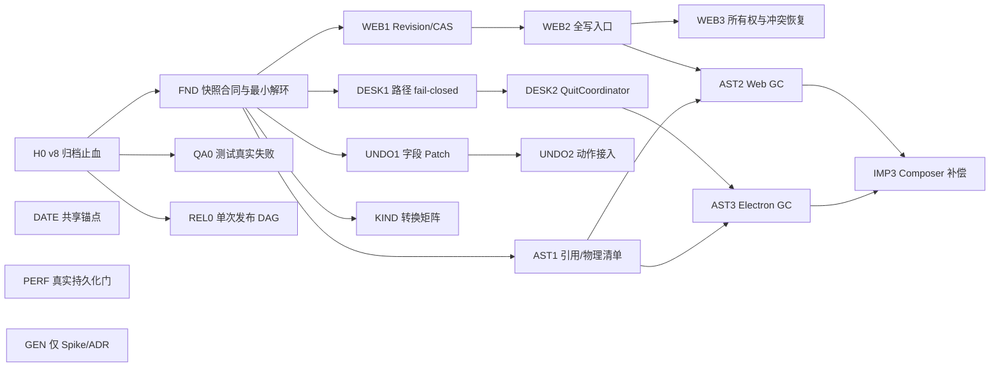

# Linear 数据可靠性整改 Spec v2

> 日期：2026-07-22
> 状态：已批准，实施中
> 基线：`main@f024be5`
> 范围：数据合同、持久化一致性、退出安全、领域规则、测试与发布门禁
> 预计：核心计划 39 工程师日；Generation 决策 Spike 另计 3 工程师日
> 后续：完成干净源码的双平台正式证据与两轮全局独立复核

## 0. 执行结论

本计划的总状态是 **HOLD**：在本文定义的发布门禁通过前，不得把“数据可靠性整改完成”或“多标签页安全”作为已交付能力宣传。

唯一允许先行的例外是 **Release 0 数据止血**：修复 v8 归档静默丢字段、让测试失败真实阻断、把 Windows/macOS 构建改成汇总后单次发布。Release 0 不等待后续架构整改。

本 Spec 采用以下总原则：

1. 先阻止静默数据损失，再做结构收口。
2. 复用现有原子事务、切库门、待处理任务追踪和退出握手，不重写已经有效的机制。
3. 用一个快照字段合同消除手写字段清单分叉；编解码合同与“合并/替换”业务策略分层。
4. Web 的正确性由持久化 revision + CAS 保证；Web Locks 只提供单编辑者体验，不能成为正确性前提。
5. Electron 的正常退出由一个协调器收口；强制杀进程只保证“最后一次已确认落盘 revision”，不承诺保存尚在内存中的编辑。
6. “从当前资料库永久删除”不等于“从历史备份中隐私抹除”。后者是独立项目。
7. 不为了本轮整改引入 v9、Generation 生产布局、全局 Command Bus 或大规模 UI 重构。

## 1. 文档权威、使用方式与变更纪律

### 1.1 权威顺序

发生冲突时按以下顺序处理：

1. 可复现的运行时行为与已验证数据；
2. 本 Spec 中标记为“已锁定”的裁决；
3. 当前类型、测试和实现；
4. 旧文档与历史注释。

实施者发现本 Spec 与真实代码不一致时，不得静默选择一种解释。必须在对应工作包中记录：证据、影响、拟议修订和是否改变验收门槛。

### 1.2 每个工作包的完成定义

每个工作包均为 1–3 天，必须独立满足：

- 输入文件和依赖已满足；
- 先有会失败的回归或故障注入，再改实现；
- 输出仅触及本包列出的职责；
- 本包验收命令通过；
- 对失败路径有明确断言，不能只断言“没有抛错”；
- 回滚不会要求修改或删除用户数据；永久删除类工作包除外，必须在执行前取得用户确认；
- 文档、错误文案和测试描述与真实保证一致。

### 1.3 不允许的完成方式

- 不得通过恢复已删除的产品功能来让过期 QA 脚本变绿。
- 不得用固定测试数量证明覆盖完整。
- 不得仅增加 try/catch 后吞掉错误。
- 不得把 Web Locks、BroadcastChannel 或 UI 锁当作持久化并发控制。
- 不得把 `fsync(file) + rename` 描述成所有文件系统上的绝对断电安全。
- 不得把自动备份仓中的历史副本纳入“当前库永久删除”的承诺。
- 不得在某一平台构建成功后提前创建公开 Release。

## 2. 已核验的当前事实

基线工作区在审查时为干净的 `main@f024be5`。以下不是推测，而是代码现状。

### 2.1 快照与归档

- `src/storage/types.ts:10`：`SCHEMA_VERSION = 8`。
- `src/storage/types.ts:35-60`：`PersistedSnapshot` 有 16 个活跃持久化字段；`cases`、`disputeTypes` 已废弃，不属于活跃合同。
- `src/storage/persistedKeys.ts:7-23`：已有 15 个 Zustand 引用字段注册表；`shortcuts` 位于独立 Store。
- `src/storage/persist.ts:45-82`：`pickPersisted()` 已经构造 16 字段正式快照。
- `src/lib/importExport.ts:152-174`：`buildPortableSnapshotFromState()` 已统一多个内容域的规范化。
- `src/lib/webJournalArchiveContract.ts:2`：`WEB_JOURNAL_EXPORT_VERSION = 8`，它与数据库名、快照 schema 是不同概念。
- `src/lib/webJournalArchive.ts:519-535`：Web reader 漏映射 `reviewTemplates`。
- `electron/library/journalZip.ts:527-541`：Electron 的 Web archive reader 漏映射 `weeklyReviews`、`quickNotes`、`reviewTemplates`。
- `src/storage/snapshotValidation.ts` 允许这些可选字段缺省，所以漏字段会静默回落，而不是报错。
- `src/lib/importExport.ts:283-306` 的 JSON writer 和 `586-693` 的 parser 目前没有完整携带 `profile`、`shortcuts`。
- Web 当前会明确拒绝 Electron 的 `manifest.json + journal.db` 精确归档；本轮保留这一限制。

### 2.2 Web 存储与并发

- `src/storage/adapter.ts:9-25`：`StorageAdapter` 没有持久化 revision、CAS、附件枚举或删除能力。
- `src/storage/indexedDbAdapter.ts:172-185`：普通保存是直接 `put(snapshot, 'main')`。
- `src/storage/indexedDbAdapter.ts:295-334`：导入已有 snapshot + assets 单事务提交。
- `src/storage/indexedDbAdapter.ts:341-380`：完整恢复已有单事务替换快照与附件。
- `src/storage/bootstrap.ts:90-96`：hydrate 后开启写入并订阅状态。
- `src/storage/persist.ts:129`：当前为约 400ms 去抖的全量快照保存。
- `src/lib/notionImportCommit.ts:109-124` 和 `src/lib/importExport.ts` 中的 revision 只是进程内引用比较，不是跨标签页持久化 revision。
- 仓库没有 `navigator.locks`、`BroadcastChannel`、lease、fence 或 `expectedRevision` 实现。

### 2.3 Electron 生命周期与资料库

- `electron/main.ts:157-194`：已有窗口关闭前 renderer flush 握手和 15 秒超时。
- `src/App.tsx:543`：renderer 已注册 pre-flush，会先完成草稿图片，再写稳定快照。
- `electron/updater.ts:207-240`：更新安装也有关闭握手，但入口和主窗口关闭逻辑仍然分散。
- `electron/library/backup.ts:542-578`：`before-quit` 还负责兜底备份和释放 storage。
- `electron/library/sessionGate.ts`：已有 `LibraryOperationGate`，普通操作可并行，切库/导入/恢复可独占。
- `electron/library/libraryActivation.ts`：候选库只有在 manifest 和完整 snapshot 可读后才激活。
- `electron/library/atomicFile.ts:5-32`：已有同目录临时文件、临时文件 fsync、rename；没有父目录 fsync。
- `electron/library/paths.ts:25-50`：配置路径缺失、损坏或不可用时会返回 null，随后静默落回默认目录。
- `electron/library/storage.ts:160-164`：每次保存会导出完整 SQL.js DB，再原子写文件。

### 2.4 Undo、记录类型、业务日期与附件

- `src/store/useStore.ts:70`：Undo 单元是 `{ id, prev: Trade }` 整对象快照。
- `src/store/useStore.ts:351`：undo/redo 会整体替换当前 Trade，可能覆盖动作后产生的无关编辑。
- `src/views/DetailView.tsx:1096-1098`：当前 UI 可直接修改 `tradeKind`。
- `src/lib/tradeKind.ts`：只有旧值规范化和类别判断，没有状态转换矩阵。
- `src/lib/periods.ts` 已有 `getTradingDayKey()` 和交易日起始小时。
- `src/lib/analysisScope.ts:60` 仍以日历午夜构造相对范围。
- `src/storage/assets.ts:216-225` 已能收集 Trade、WeeklyReview、QuickNote 的附件引用。
- `src/components/TradeComposer.tsx:216-228` 顺序保存图片；中途失败会遗留之前写入的孤儿附件。
- `src/lib/notionImport.ts:384-407, 636+` 会过滤失败图片后按压缩数组索引替换占位，可能把后续图片错放到前一个槽位。
- `src/storage/pendingOperations.ts` 已有待处理存储任务追踪与最多 8 轮排空。

### 2.5 测试与发布

- `scripts/run-regression-tests.mjs` 的 unit 和 browser 测试均由手写白名单发现。
- `src/components/ui/HoverIntent.browser.test.html` 是已存在但未进入 runner 的遗漏样本。
- runner 的诊断错误当前不一定改变最终 PASS 结论。
- `.github/workflows/release.yml` 在 Windows job 成功后就创建公开 Release；macOS 后续失败时会留下不完整 Release。
- release workflow 全局拥有 `contents: write`，构建 job 权限过宽。
- 重跑使用 `--clobber`，可能覆盖已公开资产。
- 同一 HEAD 的前序审查中，基础回归曾通过 520 项，但 `qa:full` 因 sidebar/workbench/10k 的过期期望失败；本 Spec 不把该历史结果当作本轮重新执行的结果。

## 3. 根因，而不是症状清单

| 根因 | 表现 | 本 Spec 的处理 |
|---|---|---|
| 快照字段在多个 reader/writer 中手写复制 | 新字段写出后被部分 reader 静默丢弃 | 单一字段注册表 + 纯 codec + 16 字段哨兵 fixture |
| “能解析”与“如何合并/替换”混在一起 | reader 漏字段、默认值和导入业务规则互相遮蔽 | raw decode → version migration → canonical snapshot → merge/replace policy |
| Web 没有持久化提交序号 | 两个标签页可用旧内存快照覆盖新数据 | revision + 单事务 CAS；Web Locks 仅改善体验 |
| 退出入口分别等待、备份、释放 | close、Cmd+Q、更新安装的失败语义不完全一致 | 单一 QuitCoordinator，所有正常退出共用一个 Promise |
| 配置“缺失”和“配置目标不可用”都折叠为 null | 用户资料库不可用时可能在默认目录看到一个新空库 | 资料库位置状态机，已配置路径一律 fail-closed |
| Undo 以整对象为恢复单位 | 撤销旧动作会覆盖后续无关字段编辑 | actionId + 字段级 before/after patch + 整组冲突预检 |
| 附件先写、记录后写且没有补偿 | 中途失败产生孤儿；删除记录不回收物理文件 | 批次提交、引用扫描、平台安全的幂等 GC |
| 测试发现依赖手工清单，发布按平台提前公开 | 新测试可漏跑；单平台成功制造“假完整发布” | 自动发现、真实失败、两平台汇总后一次 publish |
| 相对日期范围由多个页面自行决定 | 04:00 交易日边界前后统计不一致 | 共享 BusinessDateAnchor，不改持久化 schema |

## 4. 目标、成功指标与非目标

### 4.1 必须达到的目标

1. 所有受支持的 v8 序列化路径逐字段保留 16 个活跃字段。
2. Web 的旧 revision 写入不能改变 snapshot、assets 或 revision 中任何一个。
3. Web Locks 不可用时，CAS 仍能阻止丢失更新，并提供可恢复冲突流程。
4. 已配置 Electron 资料库不可用时，应用不能静默创建或打开默认资料库。
5. 所有正常退出入口至多执行一次 flush、一次备份、一次 storage release。
6. Undo 只恢复动作实际修改的字段；任一目标字段已漂移时整组拒绝、零修改。
7. `tradeKind` 只能经过专用规则转换，通用 patch 不得绕过。
8. Composer 或导入第 N 个附件失败时，不产生错误记录、错位图片或新孤儿附件。
9. 当前资料库永久删除只删除零引用附件，不触碰历史备份。
10. 相对日期范围在同一 `now + tradingDayStartHour` 下得到一致边界。
11. 新测试无需修改手工 unit 清单即可运行；browser 错误不能被最终 PASS 掩盖。
12. Windows 和 macOS 产物全部验证前，不存在公开的非草稿 Release。
13. 真实持久化路径满足第 12 节定义的性能和队列上限。

### 4.2 明确非目标

- 不把 `SCHEMA_VERSION` 或 `WEB_JOURNAL_EXPORT_VERSION` 升为 9。
- 不改 IndexedDB 名称 `linear-journal-v3`，不做生产数据库布局迁移。
- 不支持 Electron 精确归档导入 Web；Web 必须继续明确拒绝。
- 不实现 Generation 生产布局；只做独立 Spike 和 ADR。
- 不修改、扫描或删除历史自动备份中的用户内容。
- 不建设全局 Command Bus；Undo 只覆盖当前已经可撤销的交易动作。
- 不新增持久化 `businessDate` 字段，不回填历史记录。
- 不大规模拆分 `DetailView.tsx`、`useStore.ts` 或其他 UI 文件。
- 不在本计划中完成 Worker/增量快照；只有性能门失败时才另立工作包。
- 不实现自定义浏览器 lease/fence 协议。
- 不以恢复已删除 UI 的方式修复过期 QA。

### 4.3 受影响角色与签字责任

| 角色 | 主要影响 | 必须确认的证据 |
|---|---|---|
| Web 用户 | 多标签页冲突、导入/恢复、附件删除 | 无静默覆盖；冲突副本可导出；删除范围文案准确 |
| Electron 用户 | 资料库路径、退出、备份、当前库 GC | 配置路径 fail-closed；正常退出失败不强退；跨平台故障矩阵 |
| 数据合同维护者 | 新字段、归档兼容、默认值 | 16 字段穷尽性、v1–v8 fixture、四路径合同 |
| 领域规则维护者 | Undo、TradeKind、日期范围 | action 冲突矩阵、3×3 类型矩阵、边界时间矩阵 |
| Release 维护者 | CI 发现、产物汇总、公开 Release | quality contract、双平台 artifact、checksum、单 publish |
| 支持/恢复人员 | 冲突、路径丢失、超限、误删恢复 | 第 15.3 节流程能按文档演练，不需要读取用户正文 |

每个 Release Train 至少需要对应领域实现者和 Release 维护者签字；Release 3 还需要负责用户数据恢复的人确认 dry-run 与恢复归档流程。

## 5. 术语与保证边界

| 术语 | 本文定义 |
|---|---|
| CanonicalSnapshot | 历史输入经过版本迁移、类型校验和默认值规范化后，内部使用的 16 字段完整快照。 |
| Codec | 只负责原始数据与 CanonicalSnapshot 间的编解码；不访问 Store、DOM、IndexedDB、Node fs。 |
| Merge policy | JSON“合并导入”的业务规则；不是完整恢复。 |
| Replace policy | Web ZIP 或 Electron 精确归档的整库替换规则。 |
| revision | 存在 IndexedDB `meta` store 中的单调递增整数；不是 Zustand 引用比较。 |
| CAS | Compare-And-Swap，比较并交换：事务中只有当前 revision 等于 `expectedRevision` 才允许提交。 |
| graceful exit | 应用仍可执行 renderer flush、备份和 storage release 的正常退出。 |
| forced exit | 操作系统强杀、断电或进程崩溃；只保证最后一次已确认 revision。 |
| 当前库永久删除 | 从当前活动 snapshot 删除记录，并回收当前活动库中零引用的物理附件。 |
| 历史隐私抹除 | 从自动备份、手工副本等历史介质删除数据；不属于本 Spec。 |
| actionId | 一次用户意图对应的唯一撤销组标识，可包含一条或多条交易的多个字段。 |
| BusinessDateAnchor | 由 `now` 和 `tradingDayStartHour` 计算出的相对时间范围锚点；不是记录字段。 |

## 6. 全局不变量

任何工作包都不得破坏这些不变量。`INV-WEB-*` 从 Release 1 的 WEB1 起生效；Release 0 尚不存在持久化 revision/CAS，不得为了满足后续不变量扩大止血范围。

| ID | 不变量 | 可观察断言 |
|---|---|---|
| INV-SNAP-01 | 新 v8 writer 总是显式写出 16 个活跃字段 | 序列化对象的 16 个 key 全部存在 |
| INV-SNAP-02 | 历史 v1–v8 缺省字段只能在中央迁移/规范化层补默认 | reader 内没有分散的 `raw.field ?? default` 字段清单 |
| INV-SNAP-03 | 已存在但类型错误的字段不能被当成缺省 | 解析失败且原资料库零变化 |
| INV-SNAP-04 | JSON codec 保真不等于 JSON merge 覆盖个人设置 | codec 测试与 merge policy 测试分开 |
| INV-WEB-01 | 每个成功 Web 资料库事务使 revision 恰好 +1 | 成功前后差值为 1 |
| INV-WEB-02 | stale writer 的 snapshot、assets、revision 全部零变化 | 事务前后逐项相等 |
| INV-WEB-03 | CAS 正确性不依赖 Web Locks 或 BroadcastChannel | 禁用两者后双标签测试仍通过 |
| INV-QUIT-01 | 同一退出周期只有一个协调 Promise | 多入口并发请求只观察到一次副作用 |
| INV-QUIT-02 | flush/备份/release 任一步失败时，不报告正常退出成功 | 应用留存或展示可恢复错误 |
| INV-PATH-01 | 配置存在但不可用时绝不回落默认目录 | 默认目录无新 manifest/DB |
| INV-UNDO-01 | Undo 仅写 touched fields | 动作后修改的非 touched 字段保持不变 |
| INV-UNDO-02 | 同一 action 任一 touched field 冲突则整组零修改 | 多交易/多字段均保持调用前值 |
| INV-ASSET-01 | 删除前必须以最终候选 snapshot 计算全局活动引用 | 共享附件仍有引用时物理文件存在 |
| INV-ASSET-02 | Electron GC 先确认 snapshot，再删除附件 | 崩溃最多留下孤儿，不留下断引用 |
| INV-REL-01 | 构建 job 不创建公开 Release | 任一平台失败时 Release 不存在 |
| INV-REL-02 | 相同 tag 的不同内容不得覆盖 | checksum 不同的重跑失败 |
| INV-DATE-01 | 所有相对范围共享同一锚点 | 03:59/04:00 的各页面边界一致 |

## 7. 已锁定的架构设计

### 7.1 单一快照字段合同

不得另建一份与 `PERSISTED_STATE_REFERENCE_KEYS` 平行维护的手写字段数组。实施时将现有注册表提升为 16 字段快照合同，并从它派生 Zustand 引用比较所需的子集。

建议形态如下；实际命名可以调整，但依赖方向和穷尽性不能改变：

```ts
export const PERSISTED_SNAPSHOT_FIELDS = [
  'trades',
  'weeklyReviews',
  'quickNotes',
  'strategies',
  'starredIds',
  'subscribedIds',
  'pinnedStrategyIds',
  'display',
  'shortcuts',
  'tagPresets',
  'mistakeTagPresets',
  'profile',
  'savedTradeViews',
  'symbolIcons',
  'symbolCatalog',
  'reviewTemplates',
] as const satisfies readonly ActivePersistedSnapshotKey[]

export const PERSISTED_STATE_REFERENCE_KEYS = PERSISTED_SNAPSHOT_FIELDS.filter(
  (key): key is PersistedStateReferenceKey => key !== 'shortcuts',
)
```

类型层必须同时证明：

- 注册表覆盖 `PersistedSnapshot` 的全部活跃字段；
- 注册表不包含 `cases`、`disputeTypes`；
- 新增活跃字段但未登记时，类型测试或合同测试失败；
- `shortcuts` 属于快照合同，但不会被错误地当成 Zustand Store 字段；
- writer 的输出 key 集合与注册表相等，不允许依赖“可选字段没值就不写”。

建议新增唯一 fixture：`src/storage/fixtures/fullPersistedSnapshot.ts`。每个字段使用不同的非默认哨兵值；Trade、WeeklyReview、QuickNote 分别引用独立附件，再加入一个跨内容域共享附件。四条合同路径必须复用同一个 fixture。

### 7.2 解码、迁移、规范化与业务策略分层

唯一允许的数据流是：

```text
unknown bytes/object
  → format envelope validation
  → version-specific migration (v1…v8)
  → field/type validation
  → canonical normalization
  → CanonicalSnapshot
  → mergeImportPolicy 或 replaceArchivePolicy
  → adapter commit
```

`CanonicalSnapshot` 在内部必须显式拥有 16 个字段。字段缺省规则只能存在于中央迁移/规范化层：

- 历史输入中字段缺失：按输入版本使用既有默认函数补齐；
- 字段存在但类型错误：拒绝，不能用默认值掩盖损坏；
- 显式空数组或空对象：保留用户意图，除非既有领域 normalizer 明确定义其他行为；
- `reviewTemplates` 缺失时使用既有默认模板，显式 `[]` 仍是空模板集合；
- `symbolCatalog` 缺失时可按既有规则从 symbol icons 与 trades 推导；
- `cases`、`disputeTypes` 只允许读取时忽略，不能再次写出；
- 未知未来版本在任何 Store/adapter 写入前拒绝。

Codec 必须是纯模块：不得导入 Store、storage singleton、DOM、Electron 或 Node fs。Web 与 Electron 共享字段合同和纯规范化，但不共享各自的文件/事务工作流。

### 7.3 四条受支持合同路径

| ID | 路径 | 合同断言 | 操作语义 |
|---|---|---|---|
| PATH-A | JSON writer → `JSON.stringify` → `parseImportJson` | 16 字段 codec 保真 | 后续执行 merge policy，不是整库恢复 |
| PATH-B | Web ZIP writer → Web ZIP reader → IndexedDB replace | 16 字段和附件精确恢复 | replace policy |
| PATH-C | Web ZIP writer → Electron Web reader → Electron import | 16 字段和附件精确恢复 | replace/import policy |
| PATH-D | Electron exact ZIP writer → Electron exact reader | manifest、DB、attachments 精确往返 | exact replace |

明确的负向合同：Electron exact ZIP → Web reader 必须返回稳定的 `desktop-format` 类错误，并保证 Store、snapshot、assets、revision 零变化。

PATH-A 的 codec 保真与 merge policy 必须分别测试。JSON 合并导入不应因携带 `profile`、`shortcuts` 就静默覆盖当前个人设置。

Release 0 的 revision 仅是兼容观察值：若旧库中尚不存在 revision 元数据，测试将其读取为 `0`；PATH-B 成功或失败前后都只证明该兼容观察值保持 `0`。Release 0 不创建 revision 元数据、不推进 `0→1`，也不声称提供 CAS。真实 revision 初始化、`N→N+1` 和 stale writer 拒绝均从 Release 1 的 WEB1/WEB2 开始验收。

### 7.4 Merge 与 Replace 字段策略

| 字段 | 历史缺省规范化 | JSON merge | ZIP/exact replace |
|---|---|---|---|
| `trades` | `[]`，再走既有 trade/strategy 规范化 | 按 ID 合并，导入值覆盖同 ID | 候选值替换 |
| `weeklyReviews` | `[]` | 按既有 ID/normalizer 合并 | 候选值替换 |
| `quickNotes` | `[]` | 按既有 ID/normalizer 合并 | 候选值替换 |
| `strategies` | 走既有默认/引用修复 | 按 ID 合并 | 候选值替换并验证引用 |
| `starredIds` | `[]` | 并集 | 候选值替换 |
| `subscribedIds` | `[]` | 并集 | 候选值替换 |
| `pinnedStrategyIds` | `[]` | 并集 | 候选值替换 |
| `display` | `normalizeDisplay` | 当前值与导入值按既有顺序合并 | 候选值替换后规范化 |
| `shortcuts` | `{}` / 既有快捷键迁移 | 保持当前设置；仅 codec 携带 | 候选值替换后迁移 |
| `tagPresets` | 既有默认/normalizer | 去重并集 | 候选值替换后规范化 |
| `mistakeTagPresets` | 既有默认/normalizer | 去重并集 | 候选值替换后规范化 |
| `profile` | 既有默认 profile | 保持当前设置；仅 codec 携带 | 候选值替换后 hydrate |
| `savedTradeViews` | `[]` | 按既有 ID 规则合并 | 候选值替换后规范化 |
| `symbolIcons` | `{}` | 按 symbol key 合并 | 候选值替换后规范化 |
| `symbolCatalog` | 从现有数据推导 | 去重并集 | 候选值替换后规范化 |
| `reviewTemplates` | 缺失时默认模板；显式 `[]` 保留 | 按 ID 合并，当前同 ID 优先 | 候选值替换后规范化 |

任何改变上表语义的实现都属于 Spec 变更，不能混在 codec 重构中。

### 7.5 版本政策

本计划全部完成后仍必须满足：

```text
SCHEMA_VERSION = 8
WEB_JOURNAL_EXPORT_VERSION = 8
IndexedDB name = linear-journal-v3
```

不增加新的 archive 合同标记，不迁移生产数据库布局。原因是本轮修复的是既有 v8 合同的漏字段实现，新字段已经属于当前 `PersistedSnapshot`。

只有同时满足以下任一条件时，未来才允许提出 v9：

- 持久化形状发生不可被旧 reader 安全忽略的变化；
- 默认值或字段语义改变，需要确定性迁移；
- 旧格式不能在不丢数据的情况下解释；
- 需要明确的 downgrade 行为。

提出 v9 时必须同时提交 migrator、v1–v9 fixtures、未来版本拒绝测试和 downgrade 说明；不能只改常量。

### 7.6 Web revision 与单一提交原语

revision 存储在既有 IndexedDB `meta` store，key 建议为 `snapshotRevision`。已有库缺少该 key 时视为 `0`；第一次成功 v2 提交在同一事务中写为 `1`，不改数据库名称或对象仓布局。

建议采用能力接口，避免强迫 Electron 和测试 mock 实现 Web 专属语义：

```ts
interface SnapshotEnvelope {
  revision: number
  snapshot: PersistedSnapshot | null
}

interface PreparedAssetPut {
  id: string
  mime: string
  blob: Blob
}

interface RevisionedLibraryMutation {
  expectedRevision: number
  snapshot: PersistedSnapshot
  assetPuts?: readonly PreparedAssetPut[]
  assetDeletes?: readonly string[]
  assetMode?: 'merge' | 'replace'
  reason: 'autosave' | 'import' | 'restore' | 'migration' | 'purge' | 'attachment'
}

interface RevisionedStorageAdapter extends StorageAdapter {
  loadSnapshotEnvelope(): Promise<SnapshotEnvelope>
  commitLibraryMutation(
    input: RevisionedLibraryMutation,
  ): Promise<{ revision: number }>
}
```

底层事务顺序固定为：

1. 在一个 `readwrite` transaction 中读取 revision；
2. revision 不等于 `expectedRevision` 时 abort，并抛出 typed `StorageRevisionConflictError`；
3. 校验所有 asset put/delete 与候选 snapshot 的引用关系；
4. 写 snapshot；
5. 写入/删除 assets，或执行 replace；
6. 写 `revision + 1`；
7. 等待 transaction complete 后才更新 UI 的已保存状态。

必须纳入这一底层原语的 Web 写入口：

- 首次 seed 和 legacy migration；
- autosave/显式 flush；
- 新附件随记录提交；
- JSON/Notion 导入；
- Web archive replace；
- purge/GC；
- 后续任何会改变 snapshot 或其引用附件集合的迁移。

禁止保留“部分入口 CAS、部分入口 blind put”的过渡发布。可以在开发分支分步提交，但 W 系列只能整体进入 release candidate。

同一标签页的 adapter 内部必须串行提交；persistence controller 最多保留一个被合并的待提交快照。冲突不能自动用旧 snapshot 重试。

### 7.7 Web 所有权与冲突体验

正确性层始终是 CAS。

支持 Web Locks 时：

- 锁名包含 `libraryId`，例如 `linear-journal:<libraryId>:writer`；
- 获得独占锁的标签页可编辑；其他标签页进入只读；
- 用户可以请求编辑权，只有当前持有者释放后才切换；
- 锁丢失或页面进入不可恢复状态时立刻冻结新的编辑提交；
- BroadcastChannel 只通知 revision/所有权变化，不携带或裁决业务数据。

不支持 Web Locks 时：

- 多标签页都可编辑；
- 首个 CAS 成功者获胜；
- stale 标签页收到 typed conflict 后冻结自动写入；
- modal 提供“导出本标签页未保存副本”和“加载资料库最新版”；
- 不提供“强制覆盖”按钮；
- 恢复导出必须合并已提交 assets 与本标签页仍在内存的 prepared assets；若引用缺失，必须明确列出，不能宣称完整备份。

残余边界：CAS 只能约束运行 v2 提交协议的 writer。发布前已经打开且仍运行旧脚本的标签页不认识 revision，无法由本次“不升级 IDB 布局”的决策完全防住。Release 1 文案必须要求关闭或刷新旧标签页；不得把“跨版本旧标签页并发”写入已保证范围。若未来要消除此窗口，需要独立评估 IDB epoch/版本升级。

### 7.8 Electron 资料库位置状态机

`readLibraryConfig()` 不得继续用 null 同时表示“没有配置”和“配置不可用”。目标状态：

```ts
type LibraryLocationState =
  | { kind: 'unset' }
  | { kind: 'ready'; configuredPath: string; resolvedPath: string; source: 'config' | 'environment' | 'default' }
  | { kind: 'unavailable'; configuredPath: string; reason: string }
  | { kind: 'invalid'; configuredPath: string; reason: string }
  | { kind: 'needs-recovery'; configuredPath: string; reason: string }
```

解析优先级与行为：

1. 持久配置存在：只验证该路径；任何失败都 fail-closed，不看默认目录。
2. 没有持久配置但显式环境变量存在：按显式路径验证；失败同样 fail-closed。
3. 两者都不存在：才允许计算默认 Documents 路径。
4. 配置 JSON 损坏、目标不存在、不是目录、无权限、manifest 不匹配或候选库验证失败，都不能创建空库。
5. 修复路径必须由用户显式选择；只有候选库完整验证后才原子写回配置。

### 7.9 QuitCoordinator

现有 close/update 握手应收口，不按从零重写估算。推荐状态：

```text
idle
  → requesting-renderer-flush
  → flushing-storage
  → creating-verified-backup
  → releasing-storage
  → quitting | quit-and-install

任一步失败/超时 → aborted → 保持应用可用并显示原因
```

要求：

- window close、菜单/Cmd+Q、`window-all-closed`、`app.quit()`、update install 都调用同一 coordinator；
- 同一退出周期的并发请求共享一个 Promise；
- 请求包含 `requestId + webContents.id`，陈旧 ACK 无效；
- flush 成功后才开始备份，备份验证成功后才 release；
- release 必须幂等，`ensureStorage` 不得返回已释放实例；
- 任一步失败时取消正常退出，不把 storage 提前释放到不可继续使用；
- 15 秒是硬超时，超时的正常语义是取消，不是强制继续退出；
- `before-quit` 不再独立执行另一套重复副作用；
- 强杀、断电、renderer/main 崩溃只保证最后一次已确认 revision。

### 7.10 字段级、动作感知 Undo

目标结构：

```ts
interface UndoFieldPatch {
  key: keyof Trade
  before: unknown
  after: unknown
}

interface UndoTradePatch {
  id: string
  fields: readonly UndoFieldPatch[]
}

interface UndoAction {
  actionId: string
  label: string
  createdAt: string
  trades: readonly UndoTradePatch[]
}
```

规则：

- 从一次动作的最终 before/after 计算真实 diff，不能由调用方猜 touched keys；
- action 可包含多个字段、多条 trade；
- Undo 前逐个验证当前 touched field 深度等于 `after`；任一不等则整组冲突、零修改；
- Undo 只写 touched fields，保留其他字段在动作后产生的变化；
- Redo 对称：当前 touched field 必须等于 `before`；
- Toast 闭包捕获具体 `actionId`，不能简单执行“撤销栈顶”；
- Undo 仍是会话内能力，切库时清空，不进入持久化 schema；
- 只接入当前已有撤销入口，不扩展成全产品命令系统。

### 7.11 TradeKind 转换矩阵

所有类型变化必须经过纯函数 `transitionTradeKind()`；通用 `updateTradeData`、upsert、UI patch 不得夹带类型变化。导入可以创建带既有类型的记录，但不能以同 ID 绕过转换规则改变已有记录类型。

| 来源 / 目标 | `live` | `paper` | `case` |
|---|---|---|---|
| `live` | no-op | 仅 `status === 'planned'` | 禁止 |
| `paper` | 仅 `status === 'planned'` | no-op | 禁止 |
| `case` | 禁止 | 禁止 | no-op |

补充规则：

- `open`、`missed`、`win`、`loss`、`breakeven` 的 live/paper 原地转换全部禁止；
- 从交易沉淀知识时调用既有“创建案例”路径，生成新 ID，原交易不变；
- case 不得被通用编辑器原地变回 live/paper；
- 非法转换零字段变化、零 activity、零 Undo entry；
- 合法转换生成一个 actionId，并更新统计归属。

### 7.12 当前活动库附件生命周期

附件 inventory 必须从“物理清单”和“引用清单”两侧计算：

```text
physical = adapter.listAssets()
referenced = collectAssetIdsFromSnapshot(candidateSnapshot)
orphan = physical - referenced
missing = referenced - physical
```

全局活动引用覆盖 Trade.note、WeeklyReview.contentHtml、QuickNote.contentHtml。相同附件被多个内容域引用时只计一个物理对象；任一引用仍存在就不能删除。

平台提交顺序：

- Web：候选 snapshot、asset puts/deletes、revision 在同一 IndexedDB CAS 事务。
- Electron：先在独占 gate 内确认并持久化不再引用附件的 snapshot，再删除物理附件；失败最多留下 orphan，不能留下断引用。可使用当前库内带 operationId 的 `.trash` 暂存，但不得扫描 backup vault、跟随 symlink 或越界。

用户文案固定表达：

> 此操作会从当前资料库永久删除所选记录，并清理当前资料库中不再被任何记录引用的附件。自动备份或你另存的副本可能仍包含这些内容。

历史备份隐私抹除、`erase_pending`、备份重写均不属于本 Spec。

### 7.13 BusinessDateAnchor

新增或收口一个纯 helper：

```ts
interface BusinessDateAnchor {
  now: Date
  tradingDayStartHour: number
  currentTradingDayKey: string
}
```

“今天、本周、本月、YTD、滚动 7/30/90 天”等相对范围都从同一个 anchor 推导，并复用 `useLocalDateKey` 的边界刷新能力。

这不是给 Trade 推导新字段。按开仓日、平仓日、记录日、复盘完成日等筛选仍使用各自现有字段；只是范围起止必须来自同一交易日锚点。绝对日期输入不改写，schema 不变。

### 7.14 测试发现与发布 DAG

Unit runner 自动发现：

- `src/**/*.test.ts`、`src/**/*.test.tsx` 中的非 browser 测试；
- `electron/**/*.test.ts`；
- `scripts/**/*.test.mjs` 继续由 Node test 入口管理；
- browser HTML/TS 和 Node-only fixture 明确排除，不能误导入。

Browser runner 自动发现 `*.browser.test.html`，并要求 HTML 与测试模块一一对应。每个场景使用独立 page；未允许的 `console.error`、`pageerror`、超时、零测试导出、重复测试 ID 都必须非零退出。

发布 DAG 固定为：

```text
quality
 ├─ build-windows ─┐
 └─ build-macos ───┤
                   └─ publish
```

- build jobs 只有 `contents: read`，只上传 Actions Artifact；
- publish 是唯一拥有 `contents: write` 的 job；
- publish 先创建 draft，上传并核验全部资产，最后一次性转公开；
- 任一平台、checksum、文件名、版本、架构或 tag 校验失败时不得公开；
- 相同 tag + 相同 checksum 重跑为 no-op；不同 checksum 必须失败，不得 `--clobber` 已公开资产；
- tag commit 必须是 main 的祖先；repository ruleset 与 protected environment 留存配置证据；
- macOS 未签名产物明确是手工下载能力，不承诺自动更新。

## 8. 文件职责与依赖边界

### 8.1 目标依赖方向

```text
UI / Store actions
  → pure domain rules
  → persistence controller
  → StorageAdapter capability
  → IndexedDB or Electron bridge

archive workflow
  → pure snapshot codec
  → platform I/O
```

纯领域与 codec 模块不能反向导入 Store、storage singleton 或 UI。

### 8.2 本轮最小解环

只处理与可靠性工作直接冲突的依赖：

1. `useStore → importExport → useStore`：抽出纯 import types/merge/snapshot helpers。
2. `persist → storage/index → bootstrap → persist`：persistence controller 通过注入获得 adapter、snapshot provider、save status、clock。
3. `shortcutStore ↔ shortcuts/engine`：把无状态解析/匹配规则放到纯模块。
4. Electron preload 与 renderer 中重复的 bridge 类型：建立单一类型源，消除返回结构漂移。

不以文件行数作为拆分理由，不顺手拆大 UI。

### 8.3 必须复用、不得推倒的原语

- `PERSISTED_STATE_REFERENCE_KEYS` 与 `pickPersisted()`；
- `buildPortableSnapshotFromState()`；
- IndexedDB 原子 `commitImport` / `replaceArchive`；
- `flushStorageBeforeCutover()` 与交互冻结；
- `trackPendingStorageOperation()`；
- `LibraryOperationGate`；
- `openValidatedLibraryCandidate()`；
- 当前 BrowserWindow/update pre-flush 握手；
- `writeFileAtomicallySync()` 的同目录临时文件模式；
- `collectAssetIdsFromSnapshot()`；
- `getTradingDayKey()` 与 `useLocalDateKey()`；
- Notion prepare-before-commit 的控制流。

### 8.4 Do-not-touch 清单

- 不重写自动备份保留策略或历史 backup vault。
- 不把 Generation Spike 接入生产入口。
- 不把 Web archive 与 Electron exact archive 强行统一为同一种文件格式。
- 不替换整个状态管理库。
- 不大规模重构 DetailView、Sidebar、Dashboard 的视觉或交互。
- 不删除与本计划无关的旧代码或格式化整仓文件。
- 不修改已发布归档的用户文件。
- 不以 broad `any` 或跳过 validation 的方式快速通过合同测试。

## 9. Release Train 与阶段边界

| Train | 内容 | 进入条件 | 退出条件 |
|---|---|---|---|
| Release 0：止血 | H0、QA0、REL0 | 当前 main 可复现漏字段和错误发布 DAG | 四路径合同绿；错误真实阻断；两平台聚合后单次发布 |
| Release 1：基础与 Web 一致性 | FND、WEB | Release 0 已发布且观察无归档回归 | 所有 Web 写入口 CAS；双标签页故障矩阵绿；冲突恢复可用 |
| Release 2：桌面与领域安全 | DESK、UNDO、KIND、DATE | Release 1 稳定 | 路径 fail-closed；退出单协调；Undo/类型/日期矩阵绿 |
| Release 3：输入与附件生命周期 | IMP、AST | Web CAS 和 Electron 删除原语已稳定 | 失败无孤儿/错位；当前库 GC 单独发布并观察 3 天 |
| 决策流 | GEN-SPIKE | 可与 Release 1–3 并行 | ADR 只能是 Go/No-Go；不产生生产行为 |

每个 Train 可以独立回滚代码。Release 3 含不可恢复的物理删除，因此必须单独发布、默认 dry-run，并在启用前要求用户下载恢复归档。

## 10. 依赖图与并行策略



建议并行 Lane：

- Lane A：H0 → FND → Web CAS；
- Lane B：REL0/QA0 → runner 与发布验证；
- Lane C：DESK1 → DESK2 → Electron GC；
- Lane D：UNDO/KIND/DATE/输入安全。

热点文件必须串行：

| 文件 | 顺序 |
|---|---|
| `src/lib/importExport.ts` | H0 → FND → IMP1 |
| `src/lib/webJournalArchive.ts` | H0 → FND |
| `electron/library/journalZip.ts` | H0 → FND |
| `src/storage/adapter.ts` | WEB1 → AST1/AST2 |
| `src/storage/indexedDbAdapter.ts` | WEB1 → WEB2 → AST2 |
| `src/storage/persist.ts` | FND → WEB2 → PERF |
| `src/store/useStore.ts` | FND → UNDO → KIND |
| `scripts/run-regression-tests.mjs` | QA0 discovery → browser failure semantics |
| `.github/workflows/release.yml` | REL0 基础 DAG → provenance 加固 |

## 11. 可执行工作包

估时包含实现、针对性测试和本包文档，不包含代码评审等待与 CI 排队。每个包为 1–2 天；若发现需要超过 3 天，必须先拆包而不是扩大 PR。

### 11.1 Release 0：数据止血

| ID | 估时/依赖 | 主要文件 | 输出与验收 | 回滚 |
|---|---|---|---|---|
| H0 | 2 天；无 | `src/storage/persistedKeys.ts`、`src/lib/importExport.ts`、`src/lib/webJournalArchive.ts`、`electron/library/journalZip.ts`、现有归档测试 | 建立 16 字段哨兵 fixture；补 JSON `profile/shortcuts`、Web `reviewTemplates`、Electron Web reader 三字段；PATH-A/B/C/D 逐字段相等；Web exact-archive 拒绝；两个版本常量仍为 8；缺失 revision 仅按兼容值 `0` 观察，成功/失败前后均保持 `0`，不引入递增/CAS | 无迁移；回滚 reader/writer 改动，保留测试 fixture |
| QA0 | 2 天；H0 fixture 可并行 | `scripts/run-regression-tests.mjs`、过期 sidebar/workbench/10k QA、runner fixture | unit/browser 自动发现最小闭环；`console.error/pageerror` 真实失败；HoverIntent 被发现；过期 QA 对齐当前产品 | 回滚 runner；不得恢复旧产品行为 |
| REL0 | 2 天；可与 H0 并行 | `.github/workflows/release.yml`、release command tests | `quality → win/mac → publish`；构建只上传 artifact；publish 唯一写权限；失败无公开 Release；同 tag 异 hash 拒绝 | workflow 可回滚；已错误公开的 Release 需人工下架，不能用覆盖假装回滚 |

Release 0 发布命令门：

```text
pnpm typecheck
pnpm test
pnpm build
pnpm build:app
pnpm qa:electron
pnpm qa:full
四路径合同矩阵
release workflow contract tests
```

任一项失败即 HOLD，不允许以“历史已知失败”豁免。

### 11.2 基础合同与架构边界

| ID | 估时/依赖 | 主要文件 | 输出与验收 | 回滚 |
|---|---|---|---|---|
| FND1 | 2 天；H0 | 新纯 snapshot codec/fixture，`types.ts`、`snapshotValidation.ts` | raw→v1–v8 normalize→CanonicalSnapshot；字段穷尽测试；重复 normalize 幂等；reader 行为与 H0 golden 相同 | 回滚提取，保留 H0 直接修复 |
| FND2 | 2 天；H0 | `useStore.ts`、`importExport.ts`、`persist.ts`、storage barrel、shortcut/bridge types | 只打断第 8.2 节四个依赖问题；golden 行为不变；纯模块禁止反向 import | 每条依赖边独立回滚，不连带改业务 |

### 11.3 Web 一致性

| ID | 估时/依赖 | 主要文件 | 输出与验收 | 回滚 |
|---|---|---|---|---|
| WEB1 | 2 天；FND1 | `src/storage/adapter.ts`、`indexedDbAdapter.ts`、revision browser tests | `RevisionedStorageAdapter`、revision=0 兼容初始化、typed conflict、单事务 N→N+1；stale transaction 零变化 | revision meta 为附加数据，旧代码可忽略；回滚失去保护但不损坏 snapshot |
| WEB2 | 2 天；WEB1、FND2 | `persist.ts`/controller、migration、import、restore、asset write paths | 第 7.6 节所有写入口改走单一 mutation；静态入口测试找不到 snapshot store blind put；不允许半 CAS 发布 | 整组回滚；不得保留混合模式 |
| WEB3 | 2 天；WEB2 | ownership service、冲突 modal、BroadcastChannel 通知 | Web Locks 有/无两套 UX；CAS 结果相同；冲突冻结写入；可导出本标签页副本；无 force overwrite | 可单独关闭 Web Locks/通知层，CAS 保留 |
| WEB4 | 1 天；WEB3 | 两上下文 browser fixture | 两 tab 从同 revision 编辑；一胜一冲突；reload/recovery export；关闭 Locks/Channel 仍通过 | 测试包可回滚，行为回滚必须连同 WEB3 评估 |

### 11.4 Electron 路径与退出

| ID | 估时/依赖 | 主要文件 | 输出与验收 | 回滚 |
|---|---|---|---|---|
| DESK1 | 2 天；H0 | `electron/library/paths.ts`、activation、IPC、路径测试 | `unset/ready/unavailable/invalid/needs-recovery`；配置不可用不创建默认库；显式修复后才写配置 | 原配置不删除；回滚代码即可 |
| DESK2 | 2 天；DESK1、FND2 | `electron/main.ts`、`updater.ts`、`backup.ts`、新 coordinator | 所有退出入口共享 requestId Promise；flush/verified backup/release 至多一次；失败或 15s 超时取消 | 状态机无持久数据；回滚并恢复旧握手，路径 fail-closed 保留 |

### 11.5 Undo 与领域规则

| ID | 估时/依赖 | 主要文件 | 输出与验收 | 回滚 |
|---|---|---|---|---|
| UNDO1 | 2 天；FND2 | 纯 trade diff/patch 模块、store undo tests | actionId、最终 before/after diff、整组预检、对称 redo；非 touched 字段保留 | 会话内结构，可直接回滚 |
| UNDO2 | 2 天；UNDO1 | 当前 pushUndo 调用点、Toast、ReviewSession | 仅接入现有撤销动作；旧 Toast 只撤销自己的 action；批量一处冲突则零修改 | 按动作入口回滚，不新增持久字段 |
| KIND | 1 天；FND2 | `src/lib/tradeKind.ts`、Store guard、DetailView/导入测试 | 3×3 kind × 全 status 矩阵；planned live↔paper 唯一合法变化；case 只新建 | 纯规则和 UI 接线可回滚，无迁移 |

### 11.6 输入与附件

| ID | 估时/依赖 | 主要文件 | 输出与验收 | 回滚 |
|---|---|---|---|---|
| IMP1 | 2 天；FND1 | `DataIOContent.tsx`、新 import budget 模块、JSON parser/writer tests | 先完成容量测量门；采用第 12.2 节边界；limit−1/limit/limit+1；超限不调用 `file.text()`/decode；writer 不产出自身无法导入的 JSON | 未满足兼容门时不启用硬限制，只保留测量与错误 code |
| IMP2 | 1 天；FND1 | `notionImport.ts`、Notion tests | 图片结果携带原 slotId；A/坏B/C 仍对应 A/缺失/C；错误逐图片可见 | 纯映射可回滚，提交边界不变 |
| IMP3 | 2 天；AST2、AST3 | `TradeComposer.tsx`、batch/compensation tests | 本次附件全成或全回收；交易 commit/CAS 失败时无新孤儿；旧/共享附件不删除 | 禁用批次路径并恢复旧流程；已清理的仅限本次未引用新附件 |
| AST1 | 1 天；FND1 | `assets.ts`、adapter inventory、storage health | physical/referenced/orphan/missing 分类；共享引用去重；覆盖三类富文本 | 纯 inventory 回滚 |
| AST2 | 2 天；AST1、WEB2 | IndexedDB list/delete/batch/GC browser tests | purge snapshot、asset delete、revision 同一 CAS 事务；stale 零删除；object URL cache 正确失效 | 事务失败自动回滚；成功物理删除只能从用户预先归档恢复 |
| AST3 | 2 天；AST1、DESK2 | Electron images/storage/gate、GC tests | snapshot 先确认，`.trash/<operationId>` 幂等恢复，symlink/越界拒绝，backup vault 不变 | 失败搬回；成功物理删除只能从用户归档恢复 |

### 11.7 日期、性能与治理

| ID | 估时/依赖 | 主要文件 | 输出与验收 | 回滚 |
|---|---|---|---|---|
| DATE | 1 天；无 | `periods.ts`、`analysisScope.ts`、`useLocalDateKey.ts`、页面测试 | 统一 anchor；03:59/04:00、周/月/年、DST、停留跨界矩阵；零 schema/日期字段改写 | 纯 helper/接线回滚 |
| PERF | 1 天；WEB2、DESK2 | 生产 adapter benchmark、10k/20k fixtures | 测真实 IDB/SQL.js+fsync 路径；记录环境和原始样本；第 12.1 节硬门 | benchmark 可回滚；未达标则对应 release HOLD |
| GOV | 1 天；FND2、QA0 | architecture boundary、UTF-8/BOM、测试场景清单 | 仅加本计划需要的依赖方向、UTF-8、场景 ID 门；不做整仓 lint 大改 | 误报规则回滚或先 advisory，不阻塞已证明的数据安全修复 |

核心总量为 39 工程师日。两至三人并行、考虑热点文件串行和跨平台 CI 后，合理日历周期为 4–6 周。

### 11.8 非发布决策包

| ID | 估时/依赖 | 输出 | Go/No-Go |
|---|---|---|---|
| GEN-SPIKE | 3 天；DESK1，可并行 | 隔离原型、Windows NTFS/macOS APFS 故障结果、磁盘公式、ADR | 只决定是否另立 Generation Epic；Spike 代码不得进入生产 bundle |

## 12. 性能 SLO 与输入预算

### 12.1 真实持久化 SLO

当前 `benchmark-analytics.mjs` 中的 `JSON.parse/stringify` 不能证明 IndexedDB transaction、SQL.js export、fsync 或 rename 的真实性能。本计划只接受生产 adapter 路径的结果。

基准 fixture：

- 继续使用确定性 10K 数据，现有审查样本约为 10,000 trades、每条约 2 KiB note、序列化快照 25,185,136 bytes；正式门禁必须记录 generator commit、seed、实际 bytes 与 SHA-256。
- 新增 20K 容量 fixture，使用同一 generator 规则，正式门禁记录实际 bytes 与 SHA-256，不把推算值写死。
- 附件 fixture 包含 Trade、WeeklyReview、QuickNote 各自附件，以及至少一个跨三域共享引用。

| 指标 | 测量边界 | Release SLO |
|---|---|---|
| Web 10K CAS save | 生产 adapter：revision read → structured clone → snapshot/assets write → transaction complete | p95 ≤ 500ms |
| Web 20K CAS save | 同上 | p95 ≤ 1,000ms |
| Web dirty→confirmed | 真实 Store mutation 到 UI 获得 transaction complete 后显示“已保存” | p95 ≤ 2,000ms |
| Web stale conflict | transaction 开始到 typed conflict 返回 | p95 ≤ 250ms，checksum/revision 零变化 |
| Electron 10K save | JSON stringify、SQL.js update/export、临时文件写入、file fsync、rename 全包含 | p95 ≤ 1,500ms |
| Electron 20K save | 同上 | p95 ≤ 2,500ms |
| UI 单次主线程阻塞 | 10K 常规编辑与保存触发 | ≤ 50ms |
| QuitCoordinator | 请求退出到 save + verified backup + release，或明确取消 | p95 ≤ 3,000ms；15,000ms 硬超时 |
| persistence pending | 任意连续编辑期间 | 最多 1 个合并后的待提交 snapshot；不得无界排队 |
| Web ZIP 最大声明输入 | 参考 Chromium、8 GiB RAM，包含 parse/validate/commit | 峰值 JS heap < 512 MiB；无 OOM/页面崩溃 |

测量规则：

1. PR 运行缩短 smoke；nightly/release 运行 5 次 warmup + 30 次正式采样。
2. 每次保存后重新 load，校验 snapshot SHA-256、附件引用和 revision。
3. Electron 使用真实 `LibraryStorage` 与临时目录，不 mock `persistDb()`。
4. Web 使用真实 IndexedDB browser context，不用内存 Map 替代。
5. 性能 artifact 保存 OS、CPU、RAM、Node、Electron/Chromium、fixture hash、原始样本和 p95。
6. 硬上限一次失败即阻断候选；相对批准基线退化超过 20% 可在同 SHA 重跑一次，连续两次仍退化则阻断。
7. 不得在行为 PR 中顺便放宽 SLO。放宽必须有独立 ADR、资源证据和用户确认。
8. 任一门失败时停止对应 Train，另立 Worker/增量存储或流式解析工作包；不得用删除 benchmark、改成只测 stringify 或静默调大数字完成本 Spec。

### 12.2 JSON 输入预算与兼容门

候选硬边界：

```text
MAX_JSON_FILE_BYTES = 64 MiB
MAX_JSON_SINGLE_ATTACHMENT_DECODED_BYTES = 32 MiB
MAX_JSON_TOTAL_ATTACHMENT_DECODED_BYTES = 48 MiB
MAX_JSON_TOTAL_ENTITIES = 50,000
```

`MAX_JSON_TOTAL_ENTITIES` 统计所有顶层集合元素，不只统计 trades；包括 reviews、notes、strategies、各 ID 列表、views、catalog、templates、assets 等。

实施顺序固定：

1. 先运行 IMP1 的兼容测量，覆盖 1K/10K/20K、自引用附件和最大声明附件 corpus。
2. 若当前版本能成功生成的 JSON 会超过 64 MiB，writer 必须在生成前拒绝，并引导使用 `.journal.zip`。
3. importer 在 `file.arrayBuffer()` 前检查 `File.size`，并用 `TextDecoder('utf-8', { fatal: true })` 解码；非法 UTF-8 必须以 `json-contract-invalid` fail-closed，不能静默替换为 U+FFFD。
4. base64 在 `atob`/`Buffer.from` 前按编码长度和 padding 计算解码上界。
5. 所有预算、类型、关系、附件完整性验证通过后才进入 Store/adapter mutation。
6. 同一版本“成功导出的文件必须能重新导入”；不能通过让 writer 继续成功导出超限 JSON 来破坏对称性。
7. 若兼容 corpus 表明历史 v8 大文件很常见且没有可行转换路径，硬限制保持未启用，IMP1 状态为 HOLD，并另立流式解析或桌面转换工具，不得直接切断恢复能力。

稳定错误 code 至少包括：

- `json-file-too-large`；
- `json-entity-limit`；
- `json-single-asset-too-large`；
- `json-total-assets-too-large`；
- `json-invalid-base64`；
- `json-contract-invalid`。

UI、parser、writer、测试必须从同一个 limits 模块读取数值；不能复制中文错误字符串和数字。

### 12.3 已有平台预算保持不变

| 格式 | 压缩输入 | 展开输入 | 单 entry | entry 数 |
|---|---:|---:|---:|---:|
| Web `.journal.zip` | 128 MiB | 256 MiB | 32 MiB | 10,000 |
| Electron `.journal.zip` | 1 GiB | 2 GiB | 256 MiB | 20,000 |

本 Spec 不降低这些数值。若第 12.1 节的 Web heap 门失败，必须选择流式实现或在独立兼容评估后调整预算；不能继续宣称支持却允许页面 OOM。

### 12.4 Generation Spike 磁盘公式

Spike 必须在活动库第一次 mutation 前按以下公式预检，并在切换 marker 前复检：

```text
expandedTemp   = 本次导入/生成的最大临时展开量
rollbackCopy   = 新增的已验证回滚副本量
operationBytes = 本次操作预计新增量
safetyReserve  = max(512 MiB, operationBytes × 10%)

requiredFree = expandedTemp + rollbackCopy + safetyReserve
```

原型峰值目标：

```text
peakDisk <= activeLibrary × 2.2 + 512 MiB
```

Windows NTFS 与 macOS APFS 必测；exFAT、SMB/NFS、OneDrive/iCloud 同步目录和跨卷路径默认不支持，除非各自完成同一故障矩阵。检测到跨卷 `EXDEV` 必须 fail-closed。

## 13. 验收与故障注入矩阵

验收计量单位是“不变量 + 故障点 + 断言”，不是测试文件数或断言总数。每个场景使用稳定 ID，runner 输出实际执行集合；CI 校验本表要求的场景全部执行且通过。

测试层级固定为：

1. 纯 unit/contract：字段穷尽、迁移、merge、Undo、TradeKind、日期和预算边界；
2. adapter integration：真实 IndexedDB transaction、SQL.js、临时目录和附件 inventory；
3. browser/process：双标签页、真实页面错误、退出 requestId、进程/文件故障；
4. workflow contract：GitHub Actions 权限、DAG、artifact manifest、重跑语义；
5. release/manual：Windows NTFS、macOS APFS、强杀和最大容量 SLO。

低层测试不能代替高层故障证据，高层端到端也不能代替纯策略的完整参数矩阵。

### 13.1 归档与快照合同

| 场景 ID | 入口 | 故障注入 | 平台/测试建议 | 必须断言 | Gate |
|---|---|---|---|---|---|
| H0-A-16 | JSON writer→parser | 无 | `src/lib/importExportContract.test.ts` | 16 个哨兵逐字段相等；profile/shortcuts 存在 | contract-unit |
| H0-A-MISSING-* | JSON parser | 参数化删除任一字段 | 同上 | 历史可缺字段按版本规范化；新 writer 输出绝不缺字段 | contract-unit |
| H0-A-TYPE-* | JSON parser | 任一字段置错误类型 | 同上 | 在 Store/adapter 写入前稳定拒绝 | contract-unit |
| H0-B-16 | Web ZIP→Web replace | 无 | `webJournalArchive.test.ts`、Release 0 archive fixture | 16 字段、附件正确；缺失 revision 的兼容观察值在成功前后均为 `0` | web-browser |
| H0-B-ABORT | Web replace transaction | snapshot/asset put 后 abort | Release 0 archive fixture | 旧 snapshot、assets 逐项不变；缺失 revision 的兼容观察值在失败前后均为 `0` | web-browser |
| H0-C-16 | Web ZIP→Electron | 无 | `electron/library/journalZip.test.ts` | 三个曾漏字段和全部 16 字段保真 | electron-safety win/mac |
| H0-C-ASSET-N | Electron Web import | 第 N 个附件失败 | `journalZip.test.ts`、`importCommit.test.ts` | 活动库仍是导入前 checksum；引用不悬空 | electron-safety win/mac |
| H0-D-16 | Electron exact export→import | 无 | `journalZip.test.ts` | manifest、DB、attachments、16 字段精确往返 | electron-safety win/mac |
| H0-D-WEB-REJECT | exact ZIP→Web | 正常 exact 文件 | `webJournalArchive.test.ts` | `desktop-format` 错误；Store/DB 零变化 | web-browser |

### 13.2 Web 并发与写入口

| 场景 ID | 入口 | 故障注入 | 平台/测试建议 | 必须断言 | Gate |
|---|---|---|---|---|---|
| W-REV-INIT | 旧 IndexedDB 首次 v2 load/commit | revision key 缺失 | `indexedDbRevision.browser.test.ts/html` | load 为 0；第一次成功写为 1；snapshot 不重置 | web-concurrency |
| W-SAVE-STALE | autosave | A/B 同读 N，A 先提交，B 再提交 | 双 context browser test | A 为 N+1；B typed conflict；A checksum 不变 | web-concurrency |
| W-IMPORT-STALE | commitImport | 验证后、commit 前另一 tab 提交 | write-entrypoint test | 导入零部分写入；当前库保持获胜者版本 | web-concurrency |
| W-RESTORE-STALE | replaceArchive | 解析后、replace 前 revision 改变 | archive replace test | 旧库或获胜者库完整；不得混合 assets | web-concurrency |
| W-GC-STALE | purge/GC | inventory 后 revision 改变 | IndexedDB GC test | 零 asset delete、零 snapshot 变化 | asset-lifecycle |
| W-TX-ABORT-* | 单一 mutation | get/put/delete/revision 各点 abort | adapter browser test | snapshot/assets/revision 全回滚 | web-concurrency |
| W-NO-LOCKS | 普通编辑 | 移除 `navigator.locks`、BroadcastChannel | ownership browser test | CAS 结果与支持时一致；失者冻结 | web-concurrency |
| W-LOCK-LOSS | 持锁标签页 | 锁释放/页面隐藏后丢失 | ownership browser test | 立即只读；未确认修改不显示已保存 | web-browser |
| W-RECOVERY-EXPORT | 冲突 modal | prepared asset 尚未提交 | conflict browser test | 导出包含可用 prepared assets；缺失项明确列出 | web-browser |

### 13.3 Electron 路径与退出

| 场景 ID | 入口 | 故障注入 | 平台/测试建议 | 必须断言 | Gate |
|---|---|---|---|---|---|
| E-PATH-ABSENT | 首次启动 | 无 config/env | `electron/library/paths.test.ts` | 允许默认目录 | electron-safety |
| E-PATH-MISSING | 启动 | 已配置目录被移走 | 同上 | unavailable；默认目录无新 manifest/DB | electron-safety |
| E-PATH-BADJSON | 启动 | config 非法 JSON | 同上 | invalid；原文件保留；不回落 | electron-safety |
| E-PATH-PERM | 启动 | 无权限/目标是文件 | 双平台 smoke | fail-closed；用户可显式修复 | electron-safety win/mac |
| E-QUIT-MULTI | close + Cmd+Q + updater | 同时发起 | `electron/quitCoordinator.test.ts` | 共享一个 Promise；副作用各一次 | electron-safety |
| E-QUIT-STALE-ACK | renderer flush | 错 requestId/webContents.id | 同上 | ACK 被忽略；最终超时取消 | electron-safety |
| E-QUIT-FLUSH-FAIL | renderer/storage flush | reject/超时 | 同上 | 不退出、不 release；显示真实原因 | electron-safety |
| E-QUIT-BACKUP-FAIL | verified backup | 写入/校验失败 | `quitCoordinator.test.ts` + `backup.test.ts` | 不退出；storage 仍可继续使用；已有恢复点仍可验证恢复 | electron-safety win/mac |
| E-QUIT-RELEASED | repeated ensure/quit | storage 已 release | coordinator/storage tests | 不返回已释放实例；幂等处理 | electron-safety |
| E-FORCED-KILL | save 期间 | 观察原子临时文件后强杀 main 子进程 | Windows NTFS/macOS APFS 真实进程测试 | 重启为最后确认 revision；不承诺内存编辑 | release-gate win/mac |

### 13.4 Undo 与 TradeKind

| 场景 ID | 入口 | 故障注入 | 平台/测试建议 | 必须断言 | Gate |
|---|---|---|---|---|---|
| T-UNDO-UNRELATED | action A 后编辑 | 修改非 touched 字段 B | `tradeUndo.test.ts` | Undo A 后 B 保留 | domain-contract |
| T-UNDO-CONFLICT | Undo action | 修改任一 touched field | 同上 | 整组拒绝；多条 trade 零部分变化 | domain-contract |
| T-UNDO-OLD-TOAST | Toast | A、B 顺序完成后点击 A Toast | browser test | 只定位 A；不能误撤 B | web-browser |
| T-REDO-CONFLICT | Redo action | Undo 后修改 touched field | `tradeUndo.test.ts` | Redo 整组拒绝、零变化 | domain-contract |
| T-KIND-MATRIX | 专用转换 | 3×3 kind × 6 status | `tradeKindTransition.test.ts` | 仅 planned live↔paper 成功 | domain-contract |
| T-KIND-BYPASS | 通用 patch/import | patch 夹带 tradeKind、同 ID 异种导入 | Store/import tests | 不能绕过；非法变化零 activity/undo | domain-contract |
| T-CASE-COPY | 创建案例 | 从 live/paper 生成 | existing copy/create-case tests | 新 ID、新 case；原记录完全不变 | domain-contract |

### 13.5 输入与附件生命周期

| 场景 ID | 入口 | 故障注入 | 平台/测试建议 | 必须断言 | Gate |
|---|---|---|---|---|---|
| I-JSON-SIZE | file picker | 64MiB−1、=、+1 | JSON budget browser test | +1 不调用 `file.text()`；边界行为稳定 | import-safety |
| I-JSON-BASE64 | parser | 单项/累计 limit−1、=、+1；坏 padding | unit test | decode 前拒绝；Store/DB 零变化 | import-safety |
| I-JSON-WRITER | JSON export | 预计输出超限 | export test | 不生成不可回导文件；引导 ZIP | import-safety |
| I-NOTION-SLOT | Notion images | A、损坏 B、C | `notionImportImageSlots.test.ts` | A/缺失/C，不出现 A/C/错位 | import-safety |
| I-COMPOSER-N | Composer | 第 N 张保存失败 | composer attachment tests | 交易零新增；本次新附件零孤儿 | import-safety |
| I-COMPOSER-CAS | Composer commit | assets 准备后 CAS conflict | browser test | 旧/共享附件不删；可重试/恢复导出 | import-safety |
| A-INVENTORY-SHARED | inventory | 一 asset 被三域引用 | inventory tests | referenced 去重；非 orphan | asset-lifecycle |
| A-INVENTORY-MISSING | inventory | DB row/文件/引用不一致 | Web/Electron tests | 分类为 missing/orphan/foreign，不能误删 live | asset-lifecycle |
| A-WEB-DELETE-N | Web GC | 第 N 个 delete abort | IndexedDB GC test | 全事务回滚；revision 不增 | asset-lifecycle |
| A-WEB-RECOVERY | Web GC 恢复 | 成功删除后恢复操作前归档 | IndexedDB GC test | snapshot 逐字段恢复；revision 以新 CAS 单调推进；orphan 附件逐字节恢复 | asset-lifecycle |
| A-ELEC-DBFAIL | Electron GC | 移入 trash 后 DB persist 失败 | `assetGc.test.ts` | 文件搬回；snapshot 仍引用 | asset-lifecycle win/mac |
| A-ELEC-POSTDB-CRASH | Electron GC | DB 成功、unlink 前崩溃 | startup recovery test | 重启完成幂等清理；无断引用 | asset-lifecycle win/mac |
| A-ELEC-PATH | Electron GC | symlink/`../`/backup hash 相同 | `assetGc.test.ts` | 越界拒绝；backup vault 逐字节不变 | asset-lifecycle win/mac |
| A-DRYRUN-RACE | GC UI | 预览后 revision 改变 | browser test | 提交拒绝并要求重新预览 | asset-lifecycle |

### 13.6 日期、测试、性能与发布

| 场景 ID | 入口 | 故障注入 | 平台/测试建议 | 必须断言 | Gate |
|---|---|---|---|---|---|
| B-BOUNDARY | 所有相对范围 | 03:59:59.999 / 04:00:00.000 | periods/analysis tests | 所有模块同日切换 | domain-contract |
| B-CALENDAR | 周/月/YTD | 跨周、月、年、DST | same | 范围一致；原日期字段不改 | domain-contract |
| B-LONG-LIVED | 页面停留 | 经过交易日边界 | browser test | 无需刷新页面自动更新 | web-browser |
| Q-DISCOVERY | regression runner | 新增未登记 fixture、重复 ID、零导出 | runner contract tests | 自动发现；三者均非零失败 | contract-unit |
| Q-PAGEERROR | browser runner | Promise resolve 后 pageerror/console.error | runner fixture | 最终仍失败；listener 不跨 page | web-browser |
| P-10K/20K | 生产持久化 | 真实 fixture | perf runner | 满足第 12.1 节且 reload checksum 相等 | persistence-slo |
| R-WIN-FAIL | release DAG | Windows job 失败 | workflow contract | 不存在公开 Release | release-contract |
| R-MAC-FAIL | release DAG | macOS job 失败 | workflow contract | 不存在公开 Release | release-contract |
| R-MISSING-ASSET | publish | 缺/空/多余/版本错资产 | release artifact tests | draft 不公开；稳定失败 | release-contract |
| R-RERUN-HASH | publish rerun | 同 tag 同 hash/异 hash | release command tests | 同 hash no-op；异 hash 失败 | release-contract |
| R-TRAIN-DRILLS | Release Train 聚合 | 任一 Train 缺 stop/rollback/userRecovery 当前执行证据 | release train drill tests | 缺任一阶段即 HOLD；四个 Train 分别输出可追溯演练报告 | release-contract |

## 14. 发布门、停止条件与回滚

### 14.1 PR 快门

任何核心工作包合并前至少运行：

```text
pnpm typecheck
pnpm test
pnpm build
contract-unit
domain-contract
web-browser（涉及 Web/UI 时）
web-concurrency（涉及存储时）
electron-safety（涉及 Electron 时，按平台矩阵）
```

关键场景不得 `skip`、`todo` 或用仅日志告警代替失败。

### 14.2 Release 全门

```text
PR 快门全部内容
pnpm qa:sidebar
pnpm qa:full
pnpm build:app
Windows Electron safety
macOS Electron safety
asset-lifecycle 双平台（Release 3 起）
真实 persistence SLO
Windows artifact audit
macOS artifact audit
publish contract
```

只有 publish job 能创建/更新 Release、上传 Release asset、更新 updater metadata 和把 draft 转公开。

### 14.3 分域停止与回滚

| 域 | 立即停止条件 | 回滚策略 |
|---|---|---|
| H0 | 任一路径任一字段回落默认、引用附件变化、Web 接受 exact archive | 回滚 writer/reader；无迁移；版本仍为 8 |
| QA/REL | runner 漏测/吞错；任一平台失败后存在公开 Release | 下架错误 Release；回滚 workflow；不得恢复 Windows 先公开 |
| WEB | stale writer 覆盖成功；任一入口仍 blind put；冲突盲重试 | 停止 Web 发布；Web Locks/UI 可关闭，但不能把已发布 CAS 回滚为 blind write |
| DESK | invalid 路径创建默认空库；flush/backup 失败后仍退出 | 取消退出/更新；保留旧配置；回滚 coordinator 但保留 fail-closed |
| UNDO/KIND | 覆盖无关字段、部分撤销、非法类型变化成功 | 临时关闭对应入口；会话 Undo 无 schema 回滚 |
| IMP | 超限后仍读取/解码；slot 错位；失败改变 Store/DB | 关闭 importer；事务/操作前状态回滚；允许用户另存错误输入 |
| AST | GC 候选包含 live/shared/backup asset；预览 revision 过期仍执行 | 打开 GC kill switch；Electron 从 trash 恢复；Web 从用户预先归档恢复 |
| DATE | 同时刻页面边界不一致；绝对日期被重写 | 回滚 helper/接线，无数据迁移 |
| PERF | 真实路径超过硬 SLO、队列无界或 OOM | 对应 Train HOLD；另立架构工作，不放宽数字 |
| GEN | mixed generation、恢复选择不确定、文件系统语义无法证明 | ADR=No-Go，删除 Spike 产物，生产不受影响 |

### 14.4 兼容与回滚细节

- H0/FND：只增加 reader 兼容与 writer 完整性，没有数据 migration；旧 v8 reader会忽略它认识范围外的可选字段。
- WEB：revision 是 meta 附加记录；回滚版本会忽略它。回滚期间必须要求关闭所有现存标签页，避免新旧协议并发。
- WEB Blob 编码切换必须采用两阶段发布：先发布兼容桥 `codex/blob-compat-bridge-v1.2.25@a861ecdb32f4a0ad81f2195a85ebcd6a8b466628`，其 reader 同时接受 object/Blob、writer 仍只写 object；桥版本成为后续 Blob writer 唯一允许的回滚目标。Blob writer 在桥版本完成至少 24 小时受控覆盖窗口、操作者确认旧标签页已刷新/关闭前保持 HOLD；覆盖证据必须绑定桥 commit、版本与批准制品 SHA-256。禁止长期双写完整 object+Blob，以免重新引入大对象 structured clone 长任务。
- DESK：配置文件不得在失败时删除或覆盖；回滚前保留用户原路径文本。
- UNDO/DATE/KIND：不改 schema，无数据回滚步骤。
- AST：dry-run 和用户归档是启用前置。成功物理删除不能靠代码回滚；只能从用户确认前生成的恢复归档恢复。
- Release：公开 Release 是外部状态，代码回滚不会自动撤销。错误发布必须人工下架并保留审计记录。

### 14.5 渐进启用开关

本仓库当前没有远程 feature flag 基础设施，因此只允许可审计的本地构建/运行时开关，不为本计划临时引入远程配置服务。

| 能力 | 初始状态 | 可关闭范围 |
|---|---|---|
| Web revision CAS | Release 1 起强制开启 | 不可在保留其他 v2 writer 时关闭；只能整体停止 Web 发布 |
| Web Locks/ownership UX | CAS 稳定后开启 | 可独立关闭并回到 CAS-only 冲突 UX |
| JSON 硬预算 | IMP1 兼容测量通过后开启 | 可退回“测量+告警”，不能绕过类型/关系/附件校验 |
| 当前库 GC | Release 3 默认 dry-run，观察 3 天后再开放提交 | kill switch 可禁用实际删除，inventory/health 保留 |
| Generation | 永远关闭 | Spike 只在隔离脚本/测试中运行 |

每次开关变化都必须记录 commit、Train、原因和恢复步骤；不得让同一个持久化协议在用户群中长期处于半 CAS、半 blind-write 状态。

## 15. 可观察性、错误语义与恢复 UX

### 15.1 稳定错误类别

实现可以细分，但不能依赖任意中文字符串判断：

| Code | 用户动作 |
|---|---|
| `snapshot-contract-invalid` | 保留原库，导出/选择其他备份 |
| `unsupported-future-version` | 使用更新版本应用 |
| `desktop-format-not-supported-on-web` | 在桌面端恢复或导出 Web 格式 |
| `storage-revision-conflict` | 导出本标签页副本，随后加载最新版 |
| `library-location-unavailable` | 重新连接原目录或显式选择修复路径 |
| `library-location-invalid` | 查看原因，选择已验证资料库 |
| `quit-flush-failed` | 留在应用内重试，不退出 |
| `quit-backup-failed` | 检查磁盘/权限后重试 |
| `quit-commit-failed` | 保持应用可用，检查 storage release/最终退出阶段后重试 |
| `import-budget-exceeded` | 使用 ZIP、缩小输入或桌面转换路径 |
| `asset-reference-missing` | 停止删除/恢复，进入健康检查 |
| `asset-gc-stale-revision` | 重新扫描并确认 |
| `undo-conflict` | 保留当前数据，提示目标字段已被后续编辑 |
| `trade-kind-transition-forbidden` | 使用“创建案例”或在 planned 状态调整 |

### 15.2 日志约束

- 记录 operationId/actionId/requestId、平台、阶段、错误 code、revision 前后值和耗时。
- 不记录交易正文、复盘 HTML、随记内容、profile、快捷键或附件字节。
- 文件路径默认只记录归一化类别或散列；用户主动打开诊断包时再显示明确路径。
- archive、import、GC、quit 的开始/成功/失败必须成对；只有成功 commit 后记录新 revision。
- 故障注入测试必须验证失败日志没有“success/saved/released”误报。

### 15.3 用户恢复流程

| 场景 | 恢复流程 |
|---|---|
| Web revision conflict | 冻结写入 → 导出本标签页副本 → 加载最新版 → 用户手动决定是否导入副本 |
| Electron 配置路径不可用 | 不创建默认库 → 展示原配置路径与原因 → 重连或显式选择已验证资料库 |
| 正常退出失败 | 保持窗口/应用可用 → 展示 flush/backup/release 阶段 → 修复后重试 |
| JSON 超限 | 在读取前拒绝 → 引导 ZIP；若历史 v8 无转换路径则不启用硬门 |
| GC stale | 放弃候选 → 重新 inventory/dry-run → 再次确认 |
| Electron GC 中断 | 启动时读取仅属于本应用的 operation marker/.trash → 搬回或完成清理 |

## 16. 风险登记

| ID | 风险 | 概率/影响 | 缓解 | 残余处理 |
|---|---|---|---|---|
| R1 | v8 不升版本导致旧/新 v8 产物看起来相同 | 中/中 | 新 writer 全字段、中央 fixture、reader 向后兼容 | 接受；这是既有合同修复，不以文件版本区分 |
| R2 | 发布前打开的旧 Web 标签页仍 blind write | 低/高 | Release 文案要求刷新/关闭；v2 CAS 内部完备 | 明确不在保证范围；未来评估 IDB epoch |
| R3 | 10K/20K 全量保存达不到 SLO | 中/高 | PERF 先测真实路径，队列上限 | HOLD，另立 Worker/增量存储，不调低标准 |
| R4 | JSON 64MiB 门切断历史恢复 | 中/高 | 先做兼容 corpus；writer/reader 对称 | 没有转换路径则不启用硬门 |
| R5 | Electron 不同文件系统的 rename/fsync 语义不同 | 中/高 | 只承诺 NTFS/APFS；故障矩阵与 ADR | 其他路径 fail-closed |
| R6 | 当前库物理删除不可恢复 | 中/高 | dry-run、同 revision、用户恢复归档、独立发布观察 | 成功删除只能从归档恢复 |
| R7 | Codec 提取改变隐含 merge 行为 | 中/高 | golden fixture；codec/merge 分层测试 | FND 回滚，H0 直接修复保留 |
| R8 | Web asset transaction 过大导致 abort/OOM | 中/中 | 输入预算、真实 P95/heap 测量 | 超限引导 ZIP/桌面，或另立 streaming |
| R9 | QuitCoordinator 收口遗漏某个退出入口 | 中/高 | 入口 inventory + 并发 requestId 测试 | 未覆盖入口时 DESK2 不得完成 |
| R10 | macOS 未签名产物被误解为自动更新能力 | 中/中 | Release 文案与 metadata 明确限制 | 不生成不可信 updater 承诺 |
| R11 | 自动发现误导入 browser/Node 不兼容测试 | 中/中 | 明确 pattern/排除和 discovery 自测 | runner 回滚，不回手工漏测模式 |
| R12 | 过度架构整改拖慢止血 | 中/高 | Release 0 与 FND 分开；H0 可独立回滚发布 | H0 优先，其他包不得阻塞 |
| R13 | Blob writer 让旧 v8 reader 静默加载空库 | 中/高 | 先发 object writer + object/Blob reader 兼容桥；Blob writer 只允许回滚到桥版本 | 覆盖窗口未确认则 Blob writer Release HOLD |

## 17. 最终 Definition of Done

### 17.1 Release 0 完成

- [ ] `SCHEMA_VERSION === 8`。
- [ ] `WEB_JOURNAL_EXPORT_VERSION === 8`。
- [ ] 16 字段注册表排除两个废弃字段。
- [ ] PATH-A/B/C/D 使用同一非默认哨兵 fixture，逐字段通过。
- [ ] Release 0 对缺失 revision 只读取兼容值 `0`；PATH-B 成功/失败前后均保持 `0`，且本阶段不创建 revision、不验收 CAS。
- [ ] Web 对 Electron exact archive 的负向合同通过。
- [ ] runner 自动发现遗漏样本并对 page/console 错误真实失败。
- [ ] stale QA 对齐当前产品，没有恢复被删除功能。
- [ ] Windows/macOS 均完成后，publish 只执行一次。
- [ ] 任一平台失败时无公开 Release。
- [ ] `pnpm typecheck/test/build/build:app/qa:electron/qa:full` 全绿。

### 17.2 核心 Spec v2 完成

- [ ] CanonicalSnapshot/codec/merge/replace 分层完成，golden 行为稳定。
- [ ] 四个最小依赖问题消失，没有引入 Store→Storage→Store 新环。
- [ ] Web 所有 snapshot/asset 写入口都经 revision CAS。
- [ ] 两标签页 stale writer 在 Web Locks 有/无时都不能覆盖。
- [ ] 冲突恢复导出与加载最新版可用，不提供 force overwrite。
- [ ] 配置 Electron 路径不可用时不创建默认空库。
- [ ] 所有正常退出入口共享一次 flush/backup/release。
- [ ] 强制退出保证文案只写“最后确认 revision”。
- [ ] Undo 不覆盖无关字段；冲突时整组零修改；旧 Toast 不误撤。
- [ ] TradeKind 全矩阵通过，case 只能通过新记录路径产生。
- [ ] JSON 预算经兼容门批准，边界 N−1/N/N+1 通过。
- [ ] Notion 中间坏图不造成后续图片错位。
- [ ] Composer 任一阶段失败不产生新孤儿。
- [ ] Web/Electron 当前库 GC 保留共享附件、不触碰 backups。
- [ ] 永久删除 UI 明确仅当前库，并先提供 dry-run/恢复归档。
- [ ] 所有相对范围共用 BusinessDateAnchor，无 schema 变化。
- [ ] 真实 10K/20K 持久化与退出 SLO 通过。
- [ ] quality-contract 场景清单全部执行，无关键 skip/todo。
- [ ] 每个 Release Train 的停止、回滚和用户恢复演练有证据。
- [ ] `docs/MIGRATION.md`、`docs/RELEASES.md` 在相应 Train 发布时同步更新。

### 17.3 Generation 决策完成

- [ ] Spike 不进入生产 bundle。
- [ ] Windows NTFS 和 macOS APFS 故障矩阵有原始结果。
- [ ] 磁盘公式与实际峰值误差有记录。
- [ ] ADR 明确写 Go 或 No-Go，不允许“先部分上线再看”。
- [ ] Go 时另立 Epic 并重新估算；本 Spec 不自动扩大范围。

## 18. 两轮独立审查的收敛结果

两轮审查都对原始全量方案给出 `DONE_WITH_CONCERNS`，并共同支持“整体 HOLD、H0 先行 GO”。本 v2 按以下方式吸收分歧：

| 争议 | 最终裁决 |
|---|---|
| 是否直接做 v9 | 否；两个版本常量保持 8，修复既有合同 |
| 是否把所有 archive 做成 Web/Electron 2×2 | 否；只承诺四条当前支持路径，Web 明确拒绝 exact desktop |
| 是否另建字段 registry | 否；扩展现有注册表并派生子集 |
| Web Locks 是否保证正确性 | 否；CAS 是唯一正确性层 |
| 是否自建 lease/fence | 否；v2 不做 |
| Electron generation 是否直接实施 | 否；只做 3 天 Spike/ADR |
| “永久删除”是否覆盖历史备份 | 否；只覆盖当前活动库 |
| Undo 是否升级全量 Command Bus | 否；只做当前动作的字段级 journal |
| live/paper 是否可随时互转 | 否；仅 planned；case 永不原地互转 |
| 是否新增 businessDate 字段 | 否；只统一相对范围 anchor |
| 测试是否按数量验收 | 否；按不变量与故障矩阵验收 |
| 发布是否允许 Windows 先公开 | 否；两平台聚合后一次公开 |
| 核心工作量 | 39 工程师日，4–6 周；Generation 另计 3 天 |

## 19. 外部约束与代码证据索引

外部约束：

- [W3C Web Locks API](https://w3c.github.io/web-locks/)：只用于协调同源上下文；本 Spec 仍以 CAS 作为持久化正确性保证。
- [Electron app 生命周期](https://www.electronjs.org/docs/latest/api/app)：退出入口和事件顺序是 QuitCoordinator 的平台边界。
- [Node.js fs 文档](https://nodejs.org/api/fs.html)：rename/fsync 的能力不能被扩写成所有文件系统上的绝对断电保证。
- [GitHub immutable releases](https://docs.github.com/en/code-security/concepts/supply-chain-security/immutable-releases) 与 [repository rulesets](https://docs.github.com/en/repositories/configuring-branches-and-merges-in-your-repository/managing-rulesets/available-rules-for-rulesets)：用于发布不可变性和 tag/main 约束。

主要本地证据：

- `src/storage/types.ts`
- `src/storage/persistedKeys.ts`
- `src/storage/persist.ts`
- `src/storage/adapter.ts`
- `src/storage/indexedDbAdapter.ts`
- `src/storage/assets.ts`
- `src/storage/pendingOperations.ts`
- `src/storage/bootstrap.ts`
- `src/lib/importExport.ts`
- `src/lib/webJournalArchive.ts`
- `src/lib/notionImport.ts`
- `src/lib/notionImportCommit.ts`
- `src/lib/analysisScope.ts`
- `src/lib/periods.ts`
- `src/lib/tradeKind.ts`
- `src/store/useStore.ts`
- `src/components/TradeComposer.tsx`
- `src/views/DetailView.tsx`
- `electron/library/journalZip.ts`
- `electron/library/paths.ts`
- `electron/library/storage.ts`
- `electron/library/backup.ts`
- `electron/library/atomicFile.ts`
- `electron/library/sessionGate.ts`
- `electron/main.ts`
- `electron/updater.ts`
- `scripts/run-regression-tests.mjs`
- `scripts/qa-release.mjs`
- `.github/workflows/release.yml`
- `.github/workflows/full-qa.yml`

## 20. Phase 4 确认项

本草案已经将两轮独立审查转成可执行边界，不再保留会改变实现路线的开放技术问题。进入实施计划前只需确认：

1. 是否接受“Release 0 先止血，其余按 3 个独立 Train 发布”；
2. 是否接受 JSON 64 MiB/单附件 32 MiB/附件合计 48 MiB/总实体 50,000 作为“先测量、后启用”的候选门；
3. 是否接受当前库永久删除前强制 dry-run，并要求用户下载恢复归档；
4. 是否接受核心 39 工程师日、Generation Spike 另计 3 天的范围。

确认后，下一步只派生任务级实施计划；不会自动修改产品代码、创建 GitHub Issue、提交或发布。
